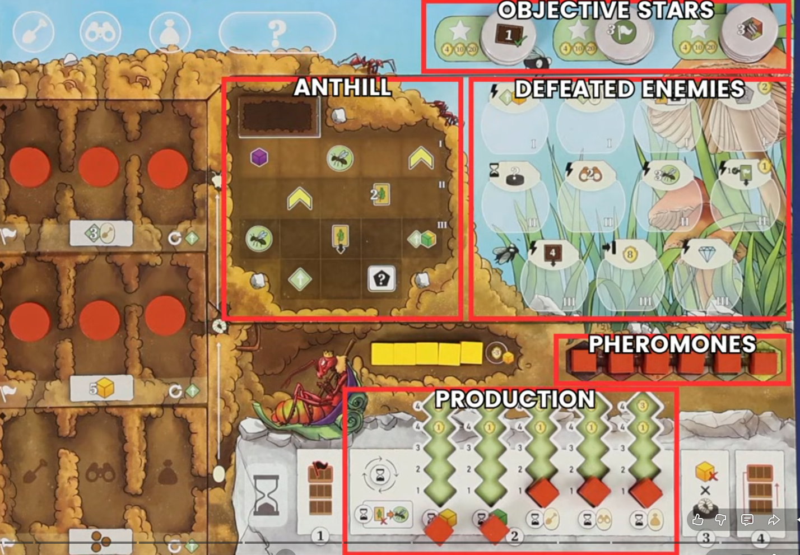

## Overview

We're all rival ant colonies that locked in a struggle for dominance of the field

## Major stuff

There's a bunch of stuff on the playerboard:

As well as the ants tracked on the left broken up into:

- Columns associated with the 3 major actions
- Rows associated with ant lifecycle. Eggs on bottom, larva in the middle, ants on top
- Space above the ground also holds ants in the printed spaces
- Managing the ants area is key in taking your actions

3 different kinds of cube resources

- Yellow are food
- Green are leaves
- Purple are mushrooms. Mushrooms can be spent as wild for food or leaves
- Players also have emergency food storage on board that can be taken at any time
- At end of game, you'll lose the highest points visible in the emergency food track

You'll pick 4 of your staring 8 cards to keep

Main board:

- Market of 9 cards
- Flight track
    - Whenever you see the flying ant icon, advance your marker on the track
    - Can share spaces just stack on top
    - If you get to a swarm scoring space that you haven't already claimed, you can put your disk there to get end game points. You then put a new disk on the bottom of the track
- Star track
    - This is the game timer, the game is over whenever this is filled

## Turn structure

Play goes clockwise from first player, and first player will never change.

On your turn, you take 1 of six actions, all shown on the reminder tile. Starting top down

### Ant actions

These are the 3 brown icons up top. Each of these actions has a corresponding row on your player board.

First, pick the action you want to do, then determine the strength of the action by looking at its column on your playerboard.

- You can spend between one and four ants to power the action
- Ants are the top most space, you can't spend larva or eggs
- If you have an ant on the matching action symbol above ground, you can use that one
- If you have any ants in the question mark field, you can use that one as well

There are a couple free actions shown at the bottom of your reminder tile

- You can spend a food to move a disk in a row to a different column
- You can spend 2 food to increase the action strength by one without spending a disk

You can never increase an action's strength above 4

No matter what strength your action was, you then take one card from the market in the row corresponding to the action. It refills immediately.

Now that you have your action strength and have drawn a card, here's how the ant actions work:

#### Dig

- Return all disks used for action strength to your supply
- Adds chambers to your anthill
- Take any combination of room tiles up to the size of your action strength (so strength 3 you could take a single 3 size tile, or a two and a one, so on)
- Add them empty side up to your board
    - A tile can always go with part of it anywhere in row one
    - Or placed adjacent to any previously palced tile
- Gain any benefits you cover

Filling up entire rows in your anthill is one of the star objectives at the top right of your board.

Whenever you fill up an entire row, take the tile from the top of that star stack, flip it over, and put it on the star track on the main board

Rows can be filled in any order

#### Explore

- Take one of the disks you removed from your board to power the action, and put it in the circular space in a hex on the main board that isn't already covered
    - The tile you place on must have dots equal to or lower than the power of your action
    - Gain the benefit shown
    - Level 4 hexes reward you a special object tile that you then put onto your playerboard
- Populate the hex with a random enemy tile in the same color as the hex
- Place 4 resource cubes of the type shown onto the tile
- If you place your disk in a hex that had cubes and an enemy from setup, all you do is get the bonus you cover, you don't add anything else to the hex

#### Forage

- Take your disks equal to the strength of the action to place on the main board
- They are placed on forage spaces, which are the spaces on the corners of the hexes
- With each forage action, the first disk you place must be on either:
    - One of the red bordered forage spaces
    - A forage space attached to a hex you have explored\
    - A forage space adjactet to one of your disks placed in a previous forage action
- After the first disk, your remaining disks must be placed in a continuous, unbranching line from the first disk
- Gain the benefit on any space you cover up
- Foraging ants collect resource cubes from adjacent explored hexes
    - Upon placing a disk, you grab one cube from any explored hex connected to your forage disk
    - This happens whenever new hexes are explored as well.
    - Whenever cubes are added to a space, if there are ants on the forage spaces of that hex, they will immediately take cubes
    - When there are more ants than cubes, the flight track is used to break ties
    - Highest up on the track grabs their full amount of cubes first. Bottom of stack is considered to be further ahead

Pheromones

- Whenever the final cube is taken from any hex, anyone with one or more foragers on that hex may emmit pheromones of that hex's color
- Take the cube from your pheromone track if you haven't already removed it and put it on the pheromone leaf of the appropriate color
- If it is your turn and you are emitting pheromones, you get to place your cube on the space that gets the bonus.
- Otherwise there is no reward for putting your pheromone cube out, just getting it off of your board.
- Foraging at an already empty hex does not get you pheromones

Pheromones are the 2nd star objective. When you've met the objective, move the tile to the star track and flip it over

### Playing cards

That covers the ant actions at the top of the reminder tile, the next option that you have available on your turn is playing up to two cards from hand

- 3 types of cards
    - Rooms (red houses)
    - Skills (blue double helix)
    - Deeds (green flag)

Top left corner shows costs and requirements.

- Cube symbol with an X means spend the cubes
- Cube symbol without X just means you need to have them (not spend them)
- Room cards require empty rooms in your anthill. Flip an empty room of at least that size over when you play the card
- Pentagon requirements are looking for those tags on cards in your tableau
- You can spend one time use tag tokens to meet these requirements as well
- There are agression tokens that can be spent for the agression tag requirement as well (two crossed swords)

Cards do stuff

- Lightning bolt is one time bonus
- Infinity sign is passive
- Hourglass gives benefit during incubation
- Arrow with line is end game scoring

Playing deeds is the 3rd star objective

### Defeating enemies

Next option on turn is playing up to one card and defeating an enemy

To defeat an enemy:

- Pick a face up enemy in a hex matching the color of one of your explored hexes
- Meet the requirements on the token the same way that you would to play a card
- Take the token from the board and put it on an empty slot of the enemies area of your playerbaord
- The space you place it in must be the same number or lower than that on the enemy
- Gain the reward shown on the space. Same as cards, can be instant, passive, etc

### Incubate

Last action on the reminder tile. This is your refresh action

- Clear out the top incubation tile (the one on the ant row)
    - You can store one ant per column in the action space above
    - Discard all others
- On the bottom of your playerboard it shows the incubation symbol (hourglass). Follow the steps from left to right:
    - Check the deed objective on the tile of your ant stack that you just emptied
    - If you meet the requirement, gain the bonus shown on the right and then flip the tile over
    - This counts as a completed deed towards the star objective (same as playing a deed card)
- Now in any order, resolve any hourglass effects
    - First two production tracks get you resources
    - Next three tracks are the number of disks you put in the egg row of the corresponding action column
    - Any hourglass effects on played cards or from defeated enemies
    - Discard a card from hand to go up on the flight track
- Next, pay one food per larva (the middle of your ant stack)
    - If you can't pay for them all from your supply you can pull food from the emergency row, or let larva die, removing them from the board
    - Then move your empty tile from the top of your ant stack to the bottom, pushing the others up. Now your previous larva are ants, eggs have become larva, and egg row is empty again

## End of the game

- End game is triggered when final star space is filled
- Finish out the round so everyone has had an equal number
- Then everyone gets 1 final turn
- Star objectives can still be met on final turns, just put them near the track
- Players then all will perform a mandatory incubation as the final step of the game

## Scoring

- Points from objective tiles shown on top of the stack (or shown on the board if you completed all objectives in a stack)
- Points on any filled enemy slots
- Points from collected special object tiles
- Points from production tracks (have to be under the cube)
- Lose highest visible points from emergency food track
- 1 point per leftover ant
- Points on all cards in tableau (including cards with end game scoring opportunities)
- Disks on swarm scoring spaces on flight track