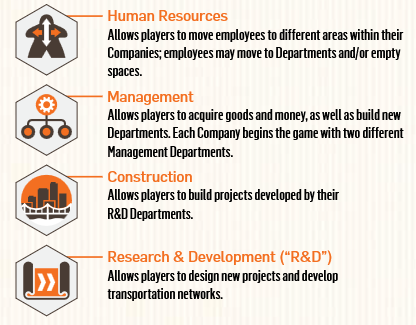
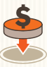
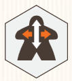
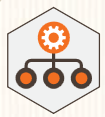
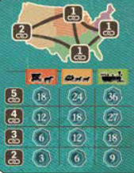

## Overview

We're running companies and expanding our business by investing in real eastage, producing goods, developing transport technology, and creating transport chains across the US.

The success of our company is of course judged by the amount of VP we can accrue

## Playerboards

Our playerboard are our company boards, and our companies are organized into departments, which are the different rooms. 

Each department corresponds to one of the game's four types of actions.

We've got project tabs on the side of the board that we'll use to keep track of housing, commerce, industry, and infrastructure that we develop

Your meeples represent your employees. They occupy the desks in your different departments. Employees that are standing up are active, employees that are laying down are inactive

As part of set up we're going to be moving some meeples around our boards and grabbing a new deparment tile, but we'll talk about how things work before that

## Main Board

- Broken up into 4 regions, with small, medium, and major cities.
- Each region also has a transportation & income track
- Donation chart up top that can get you end game points from different areas

## Gameplay

- The game is played over 20 rounds. 
- The active player gets to decide which action and which region will be activated during a round.
- Each action activates one of the 4 types of departments
- Rounds are broken up into 4 phases (shown on your player aide)
    - Select timeline: Where the first player selects the action they want to perform
    - Events
    - Use departments
    - Activeate employees and end of round

### Select timeline row

The timeline is the variable assortment of actions that will make up the game. 

Each timeline has an action associated with it, and the action marker will move down the timeline as play progresses.

- The first player selects the timeline row associated with the action that they want to perform
- They put the timeline marker (gear) to the right of the action marker for that row
    - A row can still be selected even when the action tile is on the last space of the row
    - If this happens place the gear to the right of the row and flip over the action marker on the row below.
    - We'll talk about that more whenever it happens

Every player also has an action choice tile. This tile is one time use and allows a player to select an action type different from the one chosen by the first player. If it isn't used, it will be worth 3 points at the end of the game.

### Events

Placing the timeline marker triggers an event. The two types of events are take income or make a donation

#### Income

If the timeline marker is placed on a timeline space with this icon we do an income event

These spaces are called mission areas, and employees sent out on the board are considered to be "sent on a mission". Starting with the first player, each player that has at least 1 employee in the area depicted may:

- Return 1 or more employees from the area to your lobby (they return inactive, so laying down)
- For each employee returned, take the bonus shown on the level you've reached on that region's transportation track.
- As long as at least 1 employee was returned, you will also get project income shown on all revealed project tab spaces on the side of yoour playerboard

#### Donations

If the timeline marker is placed on a space with this icon, we can do a donation. Donations can earn a lot of end game points.

Starting with the first player:

- Select an unoccupied space on the donation chart
- Pay the cost: A player's first donation cost $5, each subsequent donation is $5 more. So second is $10, third is $15
- More on donation specifics later

If any of the four rightmost positions on the timeline are triggered, each player may choose to do one or both events

### Use departments

This is where all players take actions using employees in the related departments of their companies

Starting with the first player:

- Each department may be used once for each active (standing) worker in that department.
    - Active employees will remain active until it moves or is sent on a mission
- You're not required to use all of the employees in that department
- You must finish using one department before moving on to another
- You may not return to a previously used department later in a turn

How the departments work:

#### Human resources

This is how to assign employees to different departments

- Calculate the number of possible moves:
    - For each active employee in the HR department, add the number of possible moves shown in the ability box
    - The HR departemnt printed on your board features a permanent employee in a space that shows 3 moves
        - This means you will always have a minimum of 3 moves when taking this action
- Move employees
    - Active or inactive employees may be moved
    - Move employees up to the total number of your possible moves
    - Employees must move orthoganally, never diagonal
    - Employees may move through any spaces on the board
    - So to move from a department to any adjacent deparment is one move, to a department adjacent to the new one would be a second move
    - Employees can be moved to empty departments
    - You total movement is what you can divy up between all your employees, NOT MOVEMENT FOR EACH
    - Moving an active employee makes it inactive (so it will go from standing up to now laying down in its destination)
    - Each department can hold one active employee per workstation there, and any number of inactive employees
    - Movement poitns are calculated at the beginning of the turn, so moving an employee out of HR will not reduce the moves that you get on that turn

#### Management

This is how we'll generate reseources and build new departments

- For each active employee in a management department, choose one action in the box above the employee
- Gain the resources shown from the chosen space, or execute the action shown in the space
- Two pre printed ones on your playerboard
    - One gives you money or a resource cube, or lets you send an employee on a mission and immediately gives money or resource cubes
    - The other lets you place new deparments for resource cubes. One cube to go on an empty space where you have an employee, or 2 cubes to go on an empty space
- The first new department that you build must be the one you selected during set up

#### Construction

This is how we'll build housing, commerce, industry, and public infrastructure projects

- An active employee in the construction department may be sent to the mission area of the region where you want to build
- Pay 1 or 2 good cubes depending on the type of project being built (shown next to the tracks on your playerboard)
- Move a disk from the corresponding project tab onto free space in that same region
    - If more than one disk is available, you must choose the one furthest to the right
    - Disk must be placed on a space matching the project type or on a small city
- If you build a project into a small city with the transport income icon, immediately receive the income below your disk on that region's transport track

#### Research and Development

This is how we'll improve transportation networks and develop construction projects

- Calculate study points
    - Get the points shown in that department for each active employee there
- Points can be spent in two ways
    - Move any project tab one space to the right and place a disk on the newly revealed circle
    - Move one of your transport disks on any regional transportation track one space to the right
    - Only one player may occupy the final space on a transportation track
    - Either way, pay the indicated points icons
- You may advance project tabs and transportation disks more than one space in a turn
- Any unused points are lost at the end of your turn
- Advancing a project tab beyond spaces marked for construction projects will gain you extra end game points
- Can't spend points on a fully advanced project tab

### Activate employees and end round

- Activate any inactive employees in any departments by paying the cost at the workstation
- Stand them up to indicate that they're now active
    - Remember moving employees makes them inactive

Once everyone has taken their turn

- The first player advances the action marker on the timeline track one space, knocking the gear off
- First player passes the first player marker and timeline marker to the next player clockwise
- That player starts the new round

## End of the game

Connections

- Players can earn up to 36 VP for establishing connections between major cities
- To gain these points, a player must have connect at least two major cities through a continuous network of their own construction disks

- Add the connection points you've earned
- Use that corresponding line in the matrix
- You'll get points according to your lowest level of transport across your connected regions
- If you have two separate networks of connections between major cities (like san francisco to chicago and new orleans to new york), you only get to score one of those networks.

## Scoring

- Any VP spaces shown in red are points gained during the game
- 3 VP for an unuse daction choice tile
- 1 VP for each active employee you have
    - Employees on missions and your printed HR employee don't count
- 2 VP for each department you've built in the lower rows of your company
- 3 VP for each department you've built in the top row of your company
- VP earned from project tabs
- VP for each construction project build in cities (shown below the city on the main board)
- VP earned from each donation (max 12 VP per donation)
- VP from the connection points we talked about

