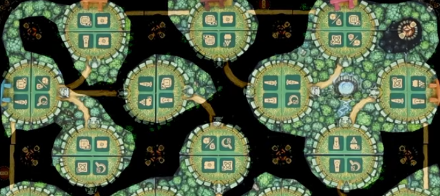
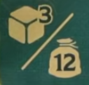
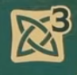
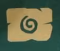
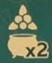
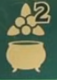
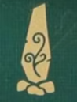

## Overview

We're druids journeying through a forest or something.

Game ends whenever someone has visted 13 shrines. 

One interesting mechanic is all of the dice that we roll WILL NEVER BE REROLLED

The rulebook is notoriously bad, and there is only one player aide tile. Please refer to this player aide. There is also a FAQ post on BGG for clarifications

Helpful player aid: https://boardgamegeek.com/filepage/320497/player-aid-english-for-the-druids-of-edora

## Board overview

There are 24 circular shrines across the map, broken up into clearings. Clearings are groups of shrines dived by patches of dark forest

Around the edge of the board are pairs of colored dolmens (the stonehenge looking things)

All the bits:

- Provisions (bags with numbers): main currency that we'll spend on most actions
- Fire tiles (circular campfires)
- Mistletoe (white berries)
- Stone tablets (grey tiles arranged around central marker)
- Magic potions (green rectangular tiles)

Central board with VP, knowledge track, gemstones, and everyone's unavailable dice

Everyone gets two playerboards:

One board has stuff we'll be putting out onto the board:

- Runestones (big)
- Standing stones (small)
- Medicinal herbs on the sickle track

## Round overview

We'll take turns clockwise each taking a turn that is up to 7. Steps will always resolve in the same order, although all steps might not resolve as a few are checks

- Move your druid
    - First turn you move into the adjacent shrine for free. On all other turns:
    - Move to a shrine not already containing one of your dice
    - Must move along path between shrines, there are some bridges (no 4 way intersections)
    - Pay provisions:
        - 1 per shrine entered or pass through
        - 1 per dark forest area crossed
- Place a die
    - Place a die from your supply on a free space in that shrine
    - Pay provisions equal to the die value
- Competition
    - If there are multiple dice on the shrine, the player who owns the highest value die gets 2 points
    - Ties are broken by the knowledge track
- Action
    - Perform the action covered by your die
- Fire
    - If you are the first player to have die in all shrines around a fire pit:
        - Gain the bonuses shown on the fire pit
        - Cover it with a fire tile. Now it is blocked
- Dolmens
    - If your dice create a continuous path between two matching dolmens
        - Gain 2 points per die on the shortest connecting path
        - Take both of the dolmens off the board
        - Take a beige dolmen from the shared board and score the points shown (if still available)
- Herbs
    - Gain herbs from the sickle track that you reached or passed this turn
    - Place them attached to your second playerboard, one face down, and one face up
        - Face up token provides a power or special action that is now always available to you
        - Face down is blocked and will never be used
    - All powers defined in the linked player aid

### Actions

#### Gain dice or provisions

- Gain 12 provisions or
- Gain 3 of your player color dice from the shared board. Grab any dice, do not re-roll.

#### Sickle track gain

- Go up indicated number on sickle track
- Herbs aren't gained until last step in turn

#### Knowledge gain

- Go up the indicated number on the knowledge track
- Stack on top of any you land on

For any of those actions, if you have reached the end of the track (or run out of dice) and would gain the bonus again, just gain 2 points

#### Gain tablet

- There is a tablet display with 12 rectangular tablet tiles
- Grab any of the 12 faceup tablet tiles
- Each tablet depicts an end game objective
- Every completed objective on a tile you own is worth 10 points
- Gain the bonus on the 2 smaller adacent oracle tiles next to the column you grabbed the tablet tile from
- Replenish the empty spot from the draw stack
- There are 2 of each tablet, you can double up (so meeting a condition once would satisfy both tablets)

#### Amulet

- Adds gemstones to the amulet on your playerboard
- The action icon will indicate a row (1,2, or 3) and an amulet multiplier
- Take a gemstone from the shared board that you don't already have
- Starting with the leftmost slot, put the gem in the indicated row of your amulet
- Gain the bonus shown on the gemstone a number of times based on the multiplier
- End of game get 10 pts per row completed
- 20 points for completing left column

#### Brewing potions

- Gain the number of mistletoe indicated
- Brew up to the number of potions shown (cauldron icon)
    - To brew pick any available potion from the supply
    - Pay the mistletoe cost
    - Resolve immediately, and in your current location if it is a location specific action (like standing stones)
    - If brewing multiple potions, you can use mistletoe generated from one to pay for the other

#### Place standing stones (small)

- Take an available standing stone from your board
- Gain the reward shown
- Add it to your location
- Now gain the reward of every one of your deployed standing stones (including the one you just placed)

#### Place a runestone (large)

- Chose any available runestone
- Add it to your location
- Gain the bonus shown for the runestone based on the pip value of the die you used to take the aciton
- You will always get better rewards for higher die values
- No other action cares about die value

### Druid in distress

If you can't afford to move and/or place a die (or if you choose to), you can take a distress turn

- Ignore normal turn structure
- Gain 6 provisions
- Gain 1 die from the shared board (if able)

## Game end

Game end is triggered when one player has placed all of their dice

- Once everyone has had the same number of turns, the game is over

## Scoring

- Add number of dice left holding, mistletoe, provisions. 6:1 for points
- 10 pts per completed stone tablet
- 10 pts per filled amulet row
- 20 points if amulet left column full
- Points from sickle space reached
- On board shrine control
    - Each shrine is controlled by the person with the single highest die value
    - Ties are broken by the knowledge track
    - Remove each die except the highest value one from each space to make this easy 
    - Each player counts up the total number of dice they have left on the board plus the number of runestones and standing stones in those shrines (total number of dice+stones)
    - Multiply this number by the furthest multiplyer you've reached on the knowledge track