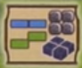
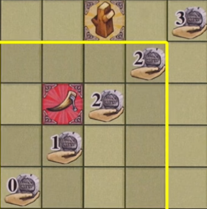
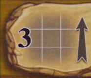

# Overview
This is a worker placement and tile laying game where we are clans of vikings stiving to be the best. At the end of 7 rounds, the player with the most victory points wins

There are a bunch of phases to a round, but most of them are administrative. The bulk of the game happens in the action phase, where we'll be putting out a number of workers on to the board to take an action and block of that spot for the remainder of the round. Most actions will award resources or tiles, which can be used to place on your player board to get income and rewards

# Major Concepts
### Playerboard
3 main components of the grid:
- Income, printed in a diagonal line
- Bonuses, randomly printed
- Negative point icons

### Tile Placement

This icon on the bottom right of your playerboard serves as a reminder for tile placement rules
- Blue and green tiles can be placed on your main playerboard with special rules
    - Green tiles can't be directly adjacent, but diagonal is fine
    - Blue tiles can be adjacent
- Coins, ore cubes, and money, can also be freely placed without restriction
- Tiles can't overlap or hang off
- Can be roated however
- Can not be moved once placed
- You can also get islands and farms, these have reminders in the corner for how tile placement works on them

### Income
On your playerboard, island, and farms, there are income symbols with a coin and hand. Every round you'll get a number of coins equal to the lowest uncovered one of these on each of your boards
- To cover an income space, you will need to cover the spaces to the left and below the symbol in a square
- In the example, all the highlighted squares would need to be covered to be able to cover the highest 2 income space

- Bonus spaces count as being covered, so you do not need to cover them to cover the income symbol
    - Bonus spaces that are completely surrounded (all 4 sides and diagonals) will earn you the depicted bonus every round

# Actions
- There are a lot of options, but they are broken down into categories for what you're trying to accomplish
- You will take a number of vikings from your player board  tree and put them on the action you want to do
    - The number of workers is determined by the column, counts are shown up top
    - Usually the more workers, the stronger the action
    - Third row also draws you a card
    - Fourth row also lets you play a card
    - Either of these card bonus actions can be done before or after your chosesn main action
- After you carry out your action, the next person in turn order will go and take 1 action
- Action spaces already occupied are blocked
## Types of Actions
- Some actions just give you stuff (example)
- Some actions with an arrow require you to sspend what is on the left to get what is on the right
- Actions that say "from" give you the depicted reward if you meet the depicted condition (milk from cows)
### Mountain and Trade
- Mountain spaces allow you to grab resources. You grab the number shown from a single mountain tile, left to right. You can't split this between multiple mountain tiles unless the space allows.
    - If a tile is emptied out, it is removed is not replaced until later in the round
- Trade spaces allow you to upgrade tiles. You upgrade tiles by either flipping them over or replacing the tile with one the same size the next color up.
    - Flow is orange > red > green > blue
- Trade action numbers tell you how many tiles you can upgrade, with the arrow indicating how much you can upgrade each tile.
- Example shows upgrading up to 3 different tiles 1 time each.

