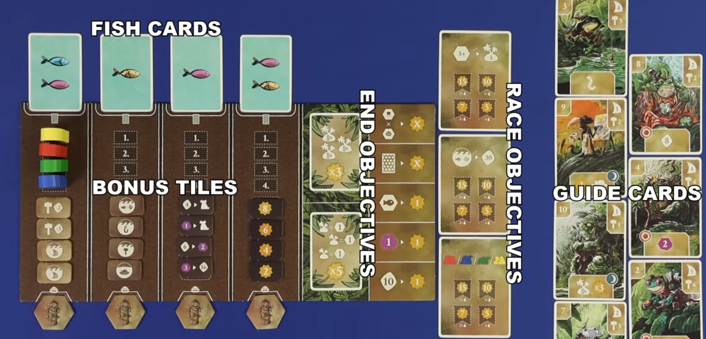
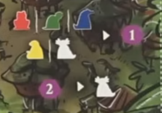
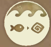
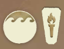
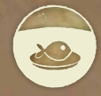

## Overview

We're clans of swamp critters striving to be the most prosperous.

We'll be doing worker placement to sail around and develop the swamp. 

- Bulding settlements costs gold and removes them from your board, unlocking your clans strengths and abilities
- Moving your ships around to fish
- Trading fish to other settlements, which get you gold, but them points

## Big concepts

### Islands

The brown icons on the board are spirit tiles, which mark the beginning of islands.

- As we add settlements and more spirit tiles to the board, we'll build out the islands
- We can never join the islands together, so there will always be as many islands as we start the game with

### Shared board

## Setup steps

- In a setup turn order we'll draft guide cards for the first round, adding a fish to each that wasn't chosen.
- We'll look at the initiative number in the top left of the drafted cards, lowest to highest will be turn oerder (low first)
- In that order we'll take turns placing one starting settlement until we've all placed 3
    - These are the ones marked with darker boarders on your playerboard
    - On turns wher you place a settlement tile with a boat, also place the boat out on the tile
    - Each starting settlment must be placed adjacent to at least 1 spirit
    - Each of your starting settlements must go on a different island

## Round overview

Game plays over 4 rounds, each round has 3 phases: Income, turns, and maintenance

### Income

Players gain any income, denoted by spaces with this icon:

- From spaces on playerboard unlocked by built settlements
- From guide card

### Turns

Here you'll be placing a worker out on an empty slot on the board and taking an action

Some action spaces have extra things

- Starbursts are points
- purple circles cost you mana (purple rocks) to go to

The main use for mana is for placing on action spaces. There are also 2 free actions you can take on your turn in addition to your main placement action

- Placing a worker to gain a mana
- Paying two mana to get a neutral worker that you can place like a normal worker

Actions are broken down into 2 major categories

- Boat actions that show a wave on their icon
- Ground actions which don't

#### Boat actions

- Taking a boat action allows you to take the action once for each boat that you have on the board
- A boat action is taken in the location where the boat token is
- Before taking an action, you may move your boat up to your sailing value
    - Sailing value on top right of guide card plus
    - Sailing value on playerboard track (in the center)
- Since your boats start in settlements, its first movement will move it into the water
- Subsequent moves must be through adjacent water spaces
- You can move through other boats, but can't end on a space with a boat in it
- You can only move your boat if you take the action. Since your action happens where your boat is, you have to move to a spot legal to do the chosen action, or else the boat doesn't move at all.

##### Build settlement

- Each boat can sail, and then build a settlement adjacent to its destination
- Take the leftmost settlement token from any of your 4 settlement rows on your playerboard
    - The settlement must be placed in an empty hex adjacent to the boat, and as part of an island which is adjacent to the boat (before the tile is placed)
    - You can't join islands together, they must always stay separated
    - You can't close off a temple space or another player's boat from the rest of the swamp (no trapping people)

##### Fish

##### Trade

##### Sail

#### Ground actions

Unlike boat actions, these are all resolved only once, and none are location dependant

##### Improve sailing

##### Celebrate

##### Add spirit worship

