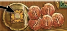
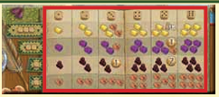
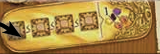
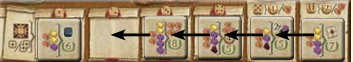

## Overview

We're traveling pals of famous explorer Marco Polo. We're collecting victory points by completing contracts, visiting lucrative cities, and other things

During a round, we'll take turns using dice to perform a single action. The round is over when everyone is out of dice. Game is over at the end of the 5th round.

As part of set up we'll all get 4 objective cards that we'll get to keep 2 of. We'll also all get a character with an asymmetric power

## Turn structure

On your turn you take at least one die from your supply and put it on an action space of your choice. You then immediately carry out the action.

- As long as you have a die, you must take an action
- Once you are out of die, you are forced to pass, and will skip the rest of your turns in this round

### Die placement rules

- Some spaces require you to place multiple dice
- If you place a die or dice on an already occupied space, you must pay an amount of coins equal to YOUR lowest die placed in that action and stack your dice on top
    - You can't stack dice on the large cities on the board (the ones with dice action spots)
    - You can't stack dice on the Favor of the Khan action (Yellow area in bottom left of board)
- Each player can only have one die (or set of dice) on a single action. So multiple people can take a specific action in a round, but you can't take the same action a second time
- The value of the lowest die placed dictates what strength an action is taken at

## Main Actions

Explaining the main actions will also go over some other major concepts

### Take 5 coins

- Value of die placed doesn't matter
- Just get 5 coins
- Must pay if spot is already taken

### Marketplace

- Main way to get goods and camels
    - Many goods used for contracts
    - Camels used for travel
- Number of die placed determine which row (or resource) you're taking
- Value of lowest die determines which column in that row (or how many of that resource)
- You may choose to take a lower value payout (like take the 5 payout even if your lowest die was a 6)

### Favor of the Khan

- Place one die, get a good of your choice and 2 camels
- First die here can be of any value
- Every subsequent die must be an equal or higher value

### Obtain contracts

- Place one die to grab one or two contracts
- Value of die determines the highest column you can grab from
    - So a die value of three could grab up to two contracts from the 1, 2, or 3 spaces.
- Taking a contract from the higher spaces also gets you your choice of coins or camels
- After the action has been taken, contracts slide to the left to fill, and the most expensive spots are replenished
- You only have room on your playerboard for 2 contracts. You must have an empty slot to take a contract
- Free action to complete, more on that in a minute

### Travel

This is how you move your piece across the board to visit other cities

- Place two dice on the travel space
- The lowest value die determines the maximum value action space you can select
    - Choose a legal action space
    - Pay the amount of money shown on the action space
    - Move your meeple that many spaces
- When moving, the path you take may incur additional costs
- Some paths show coins or camels that must be paid to take them
    - The iconograpy is weird, the +# coin means it costs that much, like on this path between cities (point at path)
- You must end your movement in:
    - A large city (named location card with an action space)
    - A small town (named location tile)
    - An oasis (unnamed circular space)
    - Can't end movement on a path
- If ending movement in a large city or small town, drop a trading post there (removed from playerboard top to bottom starting with leftmost column)
    - If in a large city this is now a new action spot available to you for the rest of the game
        - These action spaces can't have die stacked on them, only one player can go there each round
        - The first player to build a trading post in a large city gets the bonus printed on the tile up top and then it is removed from the game
    - If in a small town you get the bonus immediately, and will now gain it as income at the top of every round
    - Putting a trading post in Bejing gets you an end game scoring bonus

### Large city action spaces

- Like we just talked about, having a trading post in a large city grants you access to a new action space
- It can only have a single die there, so each of these actions can be taken a maximum of once per round
- The number die dictates how many times you get to do the action. 
    - For example if a large city action space has a conversion as the action and you place a 3 die, you can perform that conversion up to 3 times

## Free Actions

On your turn before or after taking a main action you can perform any number of free actions.

- Complete a contract
    - Pay the contracts requirements to gain its reward. 
    - Move it face down to the completed contract part of the board, that slot is now free for you to put another contract in
- Take 3 coins
    - Place 1 die in the purple coin bag oin the side of the board
    - There are never additional costs for placing here, even if other die are already present
    - A player may do this as many times as they want, as long as they have die to place
    - This is the only action that you can take multiple times in the same round
- Re-roll 1 die
    - Pay a camel to reroll a single die
- Adjust 1 die value +1/-1
    - Pay two cames to adjust value of die up or down by one. Can't wrap around from 6 to 1 or 1 to 6
- Take a black die
    - Pay 3 camels to take a blakc die from the board. Roll it and place it with the other die on your board.
    - Can be used as extra die for that round, gets returned to the supply at the end of the round
    - Each player can only take 1 black die per round

## End of the round

After everyone is out of die, prepare for the new round

- Wipe all contract tiles and renew the line up
- The person who took the travel icon last is the new start player (their dice should be on top of the stack). Play will go clockwise from them
- Small town and character income and bonuses are collected (anything with an "!" icon pays out)
- Players get all their dice back from the board and re-roll them
    - If you roll lower than 15, you can grab coins and/or camels to make up the difference

## End of game

After 5 rounds, do final scoring:

- Objective cards
- 1 VP per 10 coins
- Bejing scoring for placement order and single resource conversoin
- Player with the most contracts gets 7 points

The way the objective cards work is that you have two that each show a route

- For each card if you completed the route on it, gain the points shown
- Then look at how many of your 4 locations (across both cards) you built in, and gain the points shown on the bottom
    - If you have the same location on both cards, it is impossible to score for 4 different locations

