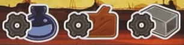
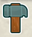
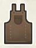

## Overview

Right up top its pronounced OR-LOY

There's a big ancient astronomical clock in Prague called Orloj. The clock mechanism has already been constructed, and we're playing teams of craftsmen working on adding on calendar dials and catholic figures that were added on in the 19th century.

If you've never heard of this clock before you should check it out, it is pretty cool.

## Boards overview

You'll start with a a sculptor (big meeple) and 4 workers unlocked (little meeples). We've got 9 more workers that we can unlock

- 3 basic resources with production tracked on your board: Iron, wood, and paint. The ? cube icon on your playerboard means any basic resource
- There are also gold and coins, which can both be spent as any basic resource
- Any matching 3 basic resources can subsitute for a gold, but there is no sub for coins

- Left side of your playerboard is a unique hammer track
- Bottom right is a rooster track
- Top gear thing holds deviation tiles
    - This game has a number of rondels that we can manipulate to move further by using these tiles
    - You force a deviation tile by flipping it from the blank side to the gear side
    - The gear icon on the board means to force a deviation, while the gear with the red x means to correct one (flip it back to unused)
    - (this symbol is show next to the action wheels)

Main board top right has 3 mastery tracks that we each have a marker on. Your postion on these tracks determine the strength of some actions

- Top of these tracks show example of points icons: Colorful is immediate, grey is game end.

## Turns overview

On your turn, you either activate the clock or pass. There's also a reminder card with all the free actions that you can take.

## Rotate the clock

- Your position on the blue track determines how many spaces you can move the clock hand. 
- To activate the clock, move it clockwise between one and that many spaces (which could also be one)
- You can move it further by forcing deviations
- You can optionally force a deviation to move the entire clock face (the light blue part) counterclockwise
    - If you do this, make sure the hand does not move with the clock face
- Place one of your workers in the cut out of the dark blue space where the hand is pointing, bumping any worker present back to their owner's supply (even yours)
- Now perform the inner ring and outter ring actions of that section in either order

### Inner actions

These are all about production and mastery

#### Production

For any of these icons, gain resources equal to your production value on your playerboard

#### Mastery

- Advance your marker on the indicated track
- Also pay a coin to advance on any track
- Gain any benefit that you enter or cross
- Some icons we'll go over in a bit, but:
    - For a red scroll collect one of the scrolls beneath the mastery tracks and then replace it. These can be spent for their effects as a free action
    - First person to reach the end of a track immediately scores that objective and removes the tile

### Outer actions

The outer ring contains the major actions

#### Upgrades

(shown as coin plus upgrade on top of outer dial)

- Move a step up your hammer track or any production track
- When all 3 production markers pass a level, unlock the worker associated with that level

#### Take an apostle

(shown as coin plus apostle on top of outer dial)

- Refer to the big gear at the top with all the apostles
- Optionally force a deviation to increment the apostle dial (spin so that higher numbers are now available)
- Take one of the 2 apostles on the bottom of the dials from your personal supply
- Move the aposlte to an empty spot on your warehouse (the left side of your playerboard with the apostle symbol on both spaces). You must have a spot available.
- After all that, increment the dials one space
- Each time a red tooth reaches the arrow next to the rooster, advance the rooster on the track above the gears. More on that in a bit

Apostles are triggered as a free action

- Take an apostle from your warehouse and move it to the section above your production tracks into a matching color space.
- Gain any benefit you cover (which could include unlocking a worker) at the cost of the resource for that row
- Completely filling a row or column gets other bonuses

#### Moon 

(appears with painter action on top of outer dial)

- Strength of action based on yellow track
- Move the moon token (small top dial with hand) exactly as many spaces as your yellow track position
- Gain every benefit entered or crossed
- Can't force deviation to increase movement

#### Painter

(appears with moon action on top of outer dial)

- Strength of action based on yellow track
- Move the painter meeple around the bottom clock face between 1 and the number of your track position
- Pick one of the two adjacent bonuses to gain
- Can't force deviation to increase movement

#### Workshop

Build one of the 3 faceup workshops (in the top left of the board)

- Cost is one paint plus 1,2, or 3 of the resource printed on the card
- Gain the benefit on the top band of the card
- Gain your worker from that slot if you haven't taken it already
- Add that card to the left or right of a row of workshops that you've previously started
    - Adding a card can complete the symbol shown on either side, earning you a bonus
- Slide remaining workshops to the right and refill from the deck

The spaces in the center of the workshop cards are for assistants

- There are 6 different assistants, each with a different end scoring objective
- You may take an assistant that you don't already have each time you earn that symbol
    - on mastery tracks
    - filling up apostle columns
- They go into your warehouse, and you must be able to make the space available
- Placing an assistant is a free action
    - Move form the workshop to one of your empty workshops
    - Pay the resource shown on the space you're covering
    - Gain the bonus that you're covering
    - That assistant's end game scoring is now unlocked as well

#### Construction

Construct a dial on the Orloj

- Choose either the month or zodiac grid
    - Month is lower left with roman numerals
    - Zodiac is lower right with zodiac symbols
- Based on the limit on your hammer track (next to the cube), move the chosen grid's hammer token between 0 and that many spaces clockwise along the printed track
- Force deviation to move further
- Choose a faceup dial adjacent to the hammer (up to 4 options)
- Pay all visible resources in row and column of chosen token
- Gain two points for each resource you pay
- Move the tile and put it yellow side up on the matching number space on the lower clock
- Put a worker on it, and gain 2 points for each worker in its adjacent cluster (counting zodiacs too)
- Gain the benefit in the painter's ring that aligns with the token you placed
- Gain the hammer track benefit from the left of your hammer track card
- Both the month and zodiac grids work the same, you can choose either with the construction action

#### Sculpt

Place your sculptor (big meeple) on one of the 4 sculptor spaces around the center of the board

- If your sculptor was already on the board, you must move to a different space
- You can go where someone else already is, it bumps them back to the owner's supply
- You'll take the action in that space accodring to the level that you've reached or passed on the pink track
- Higher you are on the track, the better your option is
- These will be a combination of main actions that we've talked about already

## Passing

Instead of activating the clock and then doing things, you can pass. You must pass if you can't place any workers.

- Resolve passing steps based on your position on the pink matery track (shown vertical on the left side of the pink track)
- Retrieve a number of workers to your supply (usually from the clock, although you can return from the calendar if you really want to)
- Activate the moon based on the sum of your yellow and pink track symbols, gaining resources like normal
- Advance the rooster at the top of the board by one step

## Rooster's call

It's finally time to talk about this rooster. The rooster is what tracks the game progression.

- At the start of the game, the cube goes on the first space of the appropriate playercount row
- The rooster begins on the matching number
- Every time a player passes, or the red tooth on the saint gear passes the arrow, the rooster advances
- At the end of a turn where the rooster reaches or passes the zero, it is time for THE ROOSTER'S CALL
    - You can take the rooster and put it on your playerboard to remind you that this happens at the end of your turn
    - Every player corrects deviations equal to their position on their personal rooster track
    - Loose one point for every deviation left uncorrected
    - Unspent points from your rooster track score you one point each (so if you would correct 3 deviations, but only have one to correct, you have two unspent roosters and gain 2 points)
- Advance the cube to the next space
- Reset the rooster to the number shown on the cube's space
- Continue to the next player's turn

## Game end

The game end is triggered by the 4th rooster's call, or by the construction of all month and zodiac tiles

- Continue until equal number of turns
- If construction triggered the end, flip the token in the middle of the calendar over
- Any further construction actions taken on final turns you pay the 4 resources to gain 8 points and the hammer bonus

### Scoring

- Each mastery track shows an objective. 
    - The highest player or tied players on that track score that objective at the higher number
    - Any other player that has reached at least level 3 on that track scores the objective at the lower number
- Score workshops
    - Below each workshop card is a track with an objective
    - During the game if you meet one of these objectives you can put a worker on the highest VP spot here as a free action
    - This worker can never be removed
    - First person to claim tha objective gains the bonus shown
- Score the objective of each assistant you've put on a workshop
- Trade up resources to gold, gold is worth one point each
- Lose one point for each uncorrected deviation
- Most points win, most apostles placed breaks ties
