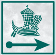
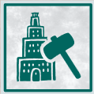
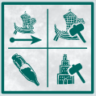

## Overview

The Roman emperor Trajan expanded the most important port in Rome, Ostia Portus, with a sick ass hexagonal basin. We're the owner of huge fleets of ships in the roman empire chartering ships, expanding our businesses, exploring distant lands, and trading.

The game doesn't have a set number of rounds, but there are several different ways for the game to end.

## Boards overview

- We'll all start in Osita and there are 4 main paths that lead to the different destination cities.
- The reward track on the side of the board keeps track of the number of points you'll get at the end of the game for several conditions based on the postion of your reward marker.
- Everyone has a couple player boards, a smaller one with boats and disks, and a larger one where we'll be mancala-ing the shit out of boats in the port to do a bunch of things.
- The spaces on your larger board are associated with resources (circle icons) and actions (square icons)

## Round overview

Starting from first player and going clockwise (first player token will never change hands):

- Select an area on your board to activate 
    - Area must have at least one ship (small ships are Corbitas, large ships are pontas)
- Produce resources:
    - Count the number of ships, with each large ship counting as 2
    - Grab that many resource cubes and put them in that section of your board
    - We use the same cubes for every resource, they just represent a different resouce depending where they sit on your board. The resource type is indicated by the multi colored cicular icon
    - Resource cubes are not limited
    - The top left section of your board is not associated with any resouce and no cubes can ever be added here regardless of the number of ships present.
- Take action
    - Grab all of the ships from the area and drop them one by one clockwise from the next section until all ships are placed
        - Large ships are treated the same as small ships for this process
    - Perform the action of the space where your last ship was placed (taking an action is a MAY, you can ignore the action if you only needed the resources from the inital area)

!!! note
    Generally an action will require the resources that are produced in the same space.

    Since you produce in one section and then take the action in another, planning ahead is key

### Main Actions

#### Move

This is how you move your ship tokens on the main board towards the destinations

- Declare the number of steps to move
- Spend the number of permits required for that movement as shown on the table in the action space
- Movement rules
    - You move along the white line to the next stop along the way on whatever path you choose
    - Each line in between tiles costs one movement to cross
    - You can't move backward
    - If you have mulitple ships on the main board, you can split your movement between them
    - You can move through other ships and share spaces with them
- Actions & effects during movement
    - When moving along a path with discover tiles, remaining, choose and take one of them. Lightning bolts are instant effects. Wild/exotic animals are kept for end game scoring
    - Discovery tiles do not end movement
    - When ending your movement on a transit tile (the hexes between location tiles on a path) you get the bonus at the end of the action. You don't gain the bonus by passing through them like discovery tiles
    - When your ship reaches a desination tile (ones at the end of each of the 4 paths) place it on the top half of the tile if you're the first person there. Otherwise, place in on the bottom half
    - Trading port tiles do not provide any effect during movement
- Route restrictions
    - Each of your ships must go to a different destination tile
        - So if one of your ships chooses the route that goes to Armenia, no other ship you place and move can go along that same path
        - The top route that splits can have 2 ships on the initial route, but both must go down different paths once it splits

#### Shipbuilding

How you add more ships to your fleet

- New ships are built starting form the bottom of the shipbuilding track
- You can build multiple ships in the same action as long as you can afford to
- Building some ships give rewards (shown to the right of the ship)
- Once you're out of ships you can't take this action any more

- Small ships (Corbitas)
    - The ship is built into any area on your Ostia port board
    - It is now treated just like the rest of them
- Large ship (ponta)
    - Take the ship and replace a small ship in your port area
    - The replaced small ship token is then placed on the ostia starting space on the main board
    - This action can only be taken if you have no ships in the costal area of the main board (denoted by the dashed line)
    - If you still have small ship tokens in the coastal area and the bottommost ship token in your shipbuilding track is a large ship, you can't take the build a ship action

#### Order

#### Build

#### Trade

#### Administration

