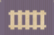

## Overview

Building railways in South Africa, who cares about story or setting

We'll be buying stocks of railroads, whoever has the majority of a railroad will lay tracks for them to become more profitable and drive the stock price up. At the end of the game we'll get payouts for stocks and whoever has the most money will win

## Initial stock round

We'll start the game by auctioning off a share of every company and launching those companies by builiding their first railways! We'll go through and auction off 1 stock for each of 5 companies, the black company will not be auctioned off just yet.

- We'll auction in the order of red, blue, orange, yellow, and purple
- Who bids first on red is random, the starting bidder of every other company will be the winner of the previous
- Minimum bid is $0 for the initial stock of each company
- On your turn either bid higher or pass. Passing means you're out for the rest of the bidding for this company
- If everyone passes without bidding, the starting bidder wins the stock for free, so don't let this happen.
- You can never bid more money than you have in your personal supply.
- When all but one player has passed, they win the auction.

Winner of each auction does the following:

- Places the winning bid into the railroad's treasury, paid from the player's personal supply. This is next to the railroads locomotives and shares. 
- Takes one share of the railroad and places it in front of them
- Builds one track at no cost, putting it adjacent to the railroad's start location
- Places the income disk on the space sharing the number with where they build their track (4 for everywhere, but could be 6 for yellow)

After all 5 of the starting railroads are established, the first player to take a turn is the person with the purple stock. Play will continue clockwise for the rest of the game.

## Core concepts

### Track links

- The gray rectangles on the main board with the train outline are the tracks that we'll be building.
- Putting a train onto a track increases that railroad's income
- Each link can only have 1 train

### Locations

- Represent areas of commerce and industry
- Spaces on the board that can be developed to provide addtional income
- Smaller settlements that are sqaures can be developed once
- Larger illustrated spaces are metro areas that can be developed multiple times

### External locations

- Represent building tracks to international or remote locations
- These show a red price, chain link, and value

### Income

A railroad's income determines how much dividend gets paid out to each shareholder of that railroad's stock. Income will only ever increase, never decrease.

Two things that will increase income:

- A railraod's train is palced on a track link increases the income by the amount shown
    - Tracks connected to metro areas show a plus sign
    - Gain income income equal to the number on the link
    - Additionally gain income equal to the lowest number shown on the metro area
- When locations are developed (putting a cube on them), they'll increase the income of railroads with connected linnks by the number shown. 
- This is also indicated by the amount of lines connected to the link since the number gets covered up by the cube.

### Railroad value

Initial stock auction had a minimum bid of $0. Further stock auctions will have a minimum bid determined by the value of the railroad.

- Each track the railroad has build counts as $5 towards the minimum bid price
- Any external connections also add the printed value towards the minimum bid price
- There is a reminder for this printed on the board

## Round overview

- The actions are shown on the right side of the board, and have a number of spaces at the bottom that can hold a player marker
- On your turn, you'll place your player marker onto an unoccupied spot and take the corresponding action.
- If all of an action's spaces are taken up, you can't chose that action.
- When you choose an action, if your action marker is in a space with an arrow, you must chose a different action this round.
- Before taking your action, move the time marker down the time track the number of spaces shown at the top of the action.
- When the marker gets to the end of the time track, that signals the end of a round. We play over 6 rounds.
- After taking your action, check to see if the black railroad opens, or if dividends are paid

## Actions

### Build track

This action has an unlimited work space, and players can activate it multiple turns in a row

- If able the player choosing this action must build track for a railroad that they have the most, or are tied for the most stock. This is defined as having control of a railroad
- Every section of track costs money to build. The money is paid by the railroad, from it's treasury to the bank. This money can't be paid by players.
- If the railraod doesn't have enough money to build a track, it is considered to be underfinanced. A player having control of an underfinanced railroad would have to chose a different railraod to build track.
- If the player doesn't control a railroad, or only controls underfinanced railroads, they must still choose a railroad (that is not underfinanced) even if they don't own any stock.
    - In this case, the railroad picked by the player that took this action would have the track decision made by the player that controls the railroad they picked
- In the case of a tie for control of a railroad, the player invoking the build track action gets to chose
- If every railroad is underfinanced, nothing happens, but the time marker still advances. That player's turn then ends.

