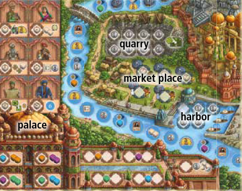

## Overview

We play venerable soverigns trading goods and developing our estates to balance our growth in prestige and prosperity

This is worker placement game where we will be using dice to pay the cost for actions. We will be focusing on going up two opposite tracks, wealth and fame. When a player's progress on these tracks meets, it triggers the end of the game.

## Flow of the game

Each round will consist of players taking turns placing one worker and carrying out the action in the chosen space. Then the next player will place worker and do the same. If you cannot place, you pass. The round continues until all players have passed. At the end of the round the first player marker moves clockwise.

You must pay the cost of the space where you are placing your worker. Some spaces show coins and will cost you that amount of movement on the money track, some spaces will show specific colored die. Die must be returned to the supply.

Dice are the most important resource in the game. Whenever you gain a die, you roll it and then place it on your Kali statue. Each of Kali's 10 hands can hold a die. If you would ever gain dice that put you over ten, you can replace any die on your statue. Dice in the supply are limited, so if you would gain a die of a color that no longer remain in the supply, you don't gain anything.

## Actions

Actions take place in one of the 4 areas of the game board

### Quarry

This actions lets you pay coins to get new tiles for your personal province board. You can pick from any of the tiles, but you must pay at least a total combined amount as shown on the tile. You can overpay, but you lose any excess. Tiles are placed on your board as soon as you get them.

#### Tile placement

- Your board has a residence with roads. Every tile you add must be able to draw a path back to your residence. Tiles can be rotated freely and can cut off paths on other tiles, as long as each tile is connected to the residence by at least one road. You cannot move tiles later once placed.
- When you connect a road to the edge of your board, you gain the bonus shown
- When you place a tile, you immediately score it
    - Some tiles show goods markets and a money value, which you gain immediately
    - Some tiles show buildings. These immediately gain you fame points equal to your progress on the appropriate building track. 

#### Upgrades

Upgrades (arrow icon) allow you to increase the points you earn for the different buildings. This only applies for future buildings, not retroactive

- one is available from a palace space
- one is available from the river
- one is available from the fame track
- one is a bonus on your player board

### Market

The market spaces allow you to generate money based on the goods available on your playerboard. The three spaces at the top each correspond to a different single good which will score. The two lower spaces will score for one market per type of good.

- When you score a good you will get the money value shown on that tile
- For the top row of single good tiles, the die that you give up will be the number of tiles that you can score. Example: if you go to the silk space and give up a die with a value of 3, you could score up to 3 different silk symbols on tiles on your player board.
- For the bottom row, you score one of each type of good. So you get poitns for your highest silk, highest tea, and highest spice.
- You cannont go to the bottom row more than once in a round (that is what the symbol is showing)

### Palace

The bottom portion is all related to gaining and manipulating dice.

- Give up a specific color to get two of a different color
- Just gain 1 of a specific color (two spaces each for workers here)
- Reroll any of your die (all at once, one time)

Upper portion is related to spending die of specific values

- Give up a one to get 2 points and take the first player token for the next round
- Give up a two to gain any 2 dice and a bonus token
- Give up a three to get 2 karma and any one die
- Give up a four for an upgrade and 3 money
- Give up a five to cover a tile on your board with one from the supply. New tile has to be paid for, but only the difference. New tile must be more expensive and still have a route back to your estate.
- Give up a six to advance 6 spaces on the river

### River

Give up a die to move. A one moves you one space, twos or threes let you move a variable amount. Other players boats are skipped over and don't count as you using movement, so you can't share spaces. You gain the bonus of the space where you end your movement.

## Other stuff

Karma is tracked above the palace. You can spend one karma to flip a die on your statue to its opposite side. This is a free action

You can unlock up to 2 additional workers during the game. There is an available worker on the money, fame, and river tracks. As soon as you meet or pass over the space you gain the worker.

## End of round

The round ends when no one can place workers anymore. If someone went to the palace space they get the first player marker, otherwise it moves clockwise.

## End of game

When someone's markers have met or passed on the money and fame tracks, the end of the game is triggered. We will take turns placing an additional worker until everyone has had an equal amount of turns (max one worker each). If multiple people have passed, the greatest difference between the markers is the winner.

