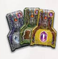

## Overview

We will compete to make our tribes the most cultured and knowledgeable. We'll do this by exploring and settline lands, gathering knowledge of ancient tribes, and making our own tribes prosper.

The game is played over 17 rounds, and the starting player will not change. 

## Round Structure

On your turn you must either use a keycard to perform actions on the board or recall to produce resouces and regain your keycards.

### Using a keycard

- Insert one of your available keycards in a vacant slot along the lower side of your player board. This activates both the keycard and the action box directly above the used slot
- All effects are optional, and you may take them in any order
- Starting keycards don't have effects, but you can get ones that have a variety of effects

### Actions

Everyone will start with the same action spaces, but these can be upgraded later. Actions Spaces can have a mix of the main actions on them.

#### Movement

The boot Icon. 

- Each move lets you move a group of your followers from one hex to an adjacent hex.
- You can move all or just some of the followers that you have there
- Movement actions with a number on the boot give multiple moves, which can be used for different groups or to move the same group multiple times. 
- If you move a group multiple times, you can choose to pick up or drop off followers along the way
- Normally you are not allowed to move onto water, volcanoes, or face-down region tiles
- The entire movement effect must be carried ou8t at once, and you cannot interrupt a movement effect with other effects. 
    - So with a move 3, you could not move twice, perform another action, and then take your remaining move

- The water movement effect lets you move 1 group of followers across an area of connected water hexes

Relicubes (the tiles with a colored cube on them)

- If you move onto or through a hex with a relicube, you must remove a number of followers from that hex to pick up the relicube
- Place the relicube on your player board in the leftmost vacant space matching the relicbue's type
- The follower cost to do so is listed above the column where the relicube is placed
- Placing a relicube gets you a reward
- If you do not have enough followers to remove from the main board to pay for this, you can't move onto or through a hex with a relicube

#### Reveal

The eyeball icon

- Reveal one face down tile.
- You must have presence on any adjacent region tile
    - A player has presence on a region tile if they have at least one follower or building on that tile
- When you flip the tile, you may orient it however you want.
- Then score 1 point for each player (including yourself) that has presence on at least 1 region tile adjacent to the newly revealed tile.
- Check for symbols on the new tile
    - Relicube symbols will have you draw a cube from the bag to fill
    - Excavation sites will have you put 3 ability stones on them

#### Develop

The shovel and hammer icon

- Each develop action lets you build or excavate in a hex where you have followers. To do this you must pay a follower cost and possibly a crystal cost
- If you build, the terrain in the hex determines what building can be built. 
- A single player can't have multiple buildings in the same hex, but multiple players can have buildings in the same hex.
- If you build adjacent to a camp (tiles with red tents), gain its reward.
    - Each player can only gain the reward from the camp once
    - Multiple players can gain the reward from the camp
    - If a camp is revealed from a flipped over tile and put adjacent to a players existing building, they then gain the reward
- Follower cost
    - To build or excavate in a hex, return one of your followers from that hex to the supply. 
    - Pay 1 additional follower for each player that already has a building in that hex. 
    - The other players then gain one additional follower into that hex
    
Types of buildings

- Buildings on your playerboard show the terrain type they may be build on next to them.
- Vaults (leftmost building)
    - After paying the follower cost take any vault from your playerboard and place it onto the vault hex on the main board
    - Gain the reward shown to the right of your chosen building on your playerboard
    - Vaults may be built in any order and do not cost crystals
    - If you choose the relicube reward, take it from the lower right of the main board. It does not cost additional followers. The relicube goes on your main board and gets you the corresponding reward.
- Workshop (middle column of buildings)
    - Workshops can be build on fields, mountains, or forests. 
    - The workshop you build comes from the lowest spot on your playerboard corresponding to that terrain type.
    - You pay the usual follower cost and the crystal cost shown.
    - From the display, take a keycard that matches the terrain of the built workshop and put it next to your playerboard
    - Green or gray keycards will replenish immediately
    - The selection of keycards is limited to what is available in the display, and the display may run out of certain types of keycards
- Monument (right column of buildings)
    - Pay the follower and crystal costs
    - You place the lowest available monument from your board
    - There are two types of monument hexes
        - If you build on a monument hext printed on the board, score points at the end of the game based on how far you've moved on the knowledge track
        - If you bild on a monument hex on a region tile, you will take a monument tile and place it on that hex
        - You and everyone else who later builds on this hex will get the reward shown on that tile

Excavating (tiles with yellow shovel)

- Pay 1 follower and 1 crystal to pick up 1 ability stone and gain one knowledge
- The chart for this is shown on the leftmost side of your playerboard
 - If there are 3 stones there (so you're the first player to remove stones here), pay a white crystal and advance 2 steps on the knowledge track that corresponds to the color of the chosen ability stone
 - If there are 2 stones present, pay a red crystal to advance 3
 - If there is only 1 stone present, pay a purple cyrstal to advance 4

