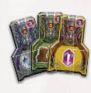
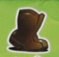
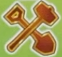
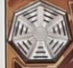

## Overview

We will compete to make our tribes the most cultured and knowledgeable. We'll do this by exploring and settling lands, gathering knowledge of ancient tribes, and making our own tribes prosper.

The game is played over a set number of rounds broken up by special rounds. Each round the starting player takes their turn, then everyone takes a turn in clockwise order. When it comes back to the starting player, they advance thr round marker and we repeat. The starting player won't change.

## Round Structure

On your turn you must either use a keycard to perform actions on the board or recall to produce resouces and regain your keycards.

## Using a keycard

- Insert one of your available keycards in a vacant slot along the lower side of your player board. This activates both the keycard and the action box directly above the used slot
- All effects are optional, and you may take them in any order
- There are reminder cubes you can use to cover an action when it is done if you're doing combo-y stuff
- Starting keycards don't have effects, but you can buy new cards that have effects on them, and upgrade your keys to better ones
- You will also upgrade your action slots by reaching different victory point thresholds

## Actions

Everyone will start with the same action spaces, but these can be upgraded later. Actions Spaces can have a mix of the main actions on them.

Lets talk about the basic actions

### Gaining followers

Followers = meeples and are used to carry out different actions on the board.

- You'll gain a number of followers from your supply and place them on the board
- They must go in either:
    - A hex where you already have a follower
    - A hex where you have a building
    - Your starting space (diamond with your turn order number)
- There is a bar next to action A that shows ways you can modify that action
    - Remove followers from the board to gain 1 white crystal for each follower removed
    - Pay crystals to gain up to 4 additional followers

### Reveal

- Reveal one face down tile by picking one adjacent to a tile where you have presence (note TILE not HEX)
    - A player has presence on a region tile if they have at least one follower or building on that tile
- When you flip the tile, you may orient it however you want.
- Then score 1 point for each player (including yourself) that has presence on at least 1 region tile adjacent to the newly revealed tile. (so a max of 4 points).
- Check for symbols on the new tile
    - Cube symbols will have you draw a cube from the bag to fill
    - Excavation sites (shovels) will have you put 3 ability stones on them

### Movement

- Each movement point lets you move a any number of your followers from one hex to an adjacent one.
    - Can't move to an unrevealed tile or hexes containing volcanoes or water
- Movement actions with a number on the boot give multiple moves, which can be used for different groups or to move the same group multiple times. 
- If you move a group multiple times, you can choose to pick up or drop off followers along the way
- The entire movement effect must be carried out at once, and you cannot interrupt a movement effect with other effects. 
    - So with a move 3, you could not move twice, perform another action, and then take your remaining move

- The water movement effect lets you move 1 group of followers across an area of connected water hexes

Relicubes (the tiles with a colored cube on them)

- If you move onto or through a hex with a relicube, you must pick up the cube
- To pick up the cube
    - Place the relicube on your player board in the leftmost vacant space matching the relicbue's type
    - Remove followers. The follower cost to do so is listed above the column where the relicube is placed
    - If you can't pay the followers, you can't pick up the cube, so you can't move into or through that space
- Placing a relicube gets you the reward the cube covers up!
    - Most of the time this reward is knowledge. Go up on the cooresponding knowledge track

### Develop

Each develop action lets you build or excavate in a hex where you have followers. To do this you must pay a follower cost and possibly a crystal cost

You excavate on a dig site (shovel) that has at least one of your followers and at least one stone.

- Remove a follower and count the stones on the space
- Pay the crystal cost determined by the number of stones in the space (depicted on the left side of your playerboard)
- Take one stone and then gain the amount of knowledge shown in the track that matches the color stone you took off of the board

- The chart for this is shown on the leftmost side of your playerboard
 - If there are 3 stones there (so you're the first player to remove stones here), pay a white crystal and advance 2 steps on the knowledge track that corresponds to the color of the chosen ability stone
 - If there are 2 stones present, pay a red crystal to advance 3
 - If there is only 1 stone present, pay a purple cyrstal to advance 4

Build in a hex with at least one of your followers and none of your buildings

- The terrain in the hex determines what building can be built, there are different sections on your board. 
- Multiple people can have buildings in a hex, but a single player can never have more than one in each hex.
    - You will always remove one follower
    - You will pay an additional follower for each other player that aleady has a building in that hex
    - That player will then add a follower of theirs to that hex (so you're essentially replacing one of yours with theirs)
- Pay the crystal cost shown under a the building matching that terrain type, and then place the building on the board.
    - Then gain the reward shown to the right of where you removed the building from (NOT what you uncovered)
- Vaults (leftmost buildings) do not have a crystal cost and can be build in any order
- The middle column are workshops and are build bottom to top, so you pay the lower cost for the first one, then the higher cost for the second one.
    - The benefit for these buildings is gaining a new keycard of the shown color
    - Green or Gray replenish immediately
    - Keycards are limited
- Monuments (right column) are also built bottom to top. They go into the white hexes on the board that come in two types
    - Printed on the board: These are just worth end game points (based on progress on the shown track)
    - Other hexes: If you're the first to build here, you get to pick the monument hex that will go here. Anyone that builds here will get endgame points and an immediate reward shown on the tile.
- For any type of building, the first time you build adjacent to a camp (tiles with red tents), gain its reward.
    - Each player can only gain the reward from the camp once
    - Multiple players can gain the reward from the camp
    - If a camp is revealed from a flipped over tile and put adjacent to a players existing building, they then gain the reward

You can also spend a development action to upgrade a single crystal to the next type (shown on the left of your playerboard)

### Free actions

Crystals can also be manipulated by free actions (shown above the workshops on your board)

- Upgrade by trading in 3 of one crystal type for one of the next tier
- Downgrade to get the exchange shown on the side of the crystal track

Another free action is to open a crate to get its reward

### Duplicate

We've talked about all the main actions that show up on your playerboard, but now we'll talk about space F, the duplicate action.

Pay a white crystal to resolve an action slot that already has a keycard in it. Resolve ONLY the following:

- Keycard in F
- Action space F
- Chosen action space 
- NOT the keycard of the chosen action space

## Tibes and gadgets

Now that we've talked about all the actions, lets talk about some of the abilities

In set up, each player gets a tribe card and gadget. These have special abilities that you can trigger by putting stones on them.

As a free action, you can move a stone from your supply to one of these placement spaces to perform the indicated action(s).

- An empty placement space costs one stone to activate
- The next activation would cost two stones, the next 3, and so on.
- A placement space with a number 1 printed on it will always cost a single stone to activate, no matter how many times it has been done.
- Most abilities can be done any time, but those that show an action icon with a colon modify that main action in some way. All in the rulebook.

Some tribes may come with additional components and/or end game scoring.

## Knowledge track

We talked about some different ways to go up these tracks during the game. These tracks are how we're RECALL-ing tribes and gadgets that have been lost to history

- First person to reach space 3 on the track flips the tribe card and then chooses one of the gadgets below it for personal use, slotting it in the side of their board.
- Further players that reach space 3 on the track just gain a gadget
- When you reach level 5 on the track, gain your color stone and unlock the effect of that tracks tribe
    - Remove the matching token from your board
    - This reveals a new stone placement spot
    - Placing a stone here as a free action lets you perform the ability on the matching tribe card
- Steps on the tracks with tokens gain you the benefit shown on the token (the token remains, all players can get the benefit)

## Recall turn

On your turn, if you don't use a keycard to perform actions, you must recall.

Steps you go through are shown in the red section next to your stone supply on playerboard

- Take out all your keycards, returning them to your supply
- For each key card returned, gain a different benefit from your playerboard shown in one of the red squares (these are uncovered by building stuff)
- Return all your stones to your supply
- You can still take free actions on a recall turn, but they must be done before or after your recall is performed
    - Only exception is that you can't activate actions with stones after the recall is performed

## Game flow

We'll keep taking turns for 13 rounds, as tracked on a side board.

Whenever we reach some spaces on the round tracker we won't do a normal round and will instead do a thing

- Roman numerals
     - In turn order, players will chose a path card for the corresponding era.
     - Move your player marker to one of the two scoring cards for end game scoring
     - Every player will score the top condition of every card
     - Players will score the bottom condition of cards with their player marker on them as well
     - Gain the bonus on the token for the era
- Purple space
     - At the start of the game everyone is dealt an endgame objective card
     - If you meet the conditions in the purple box, you'll get 15 points
     - When we reach the purple space on the round track, we'll all have to discard one of these cards
        - You'll gain the benefits in the green portion of the card you discard

During these intermediary rounds we operate in turn order and can take free actions, but we will not take normal actions. So it will be like normal round, intermediary round where we don't take main actions or recall, then normal round

After 13 rounds (plus all the intermediary rounds) we'll go to final scoring

## Scoring

- Objective card (if you met the conditions)
- Score the top half of every path card
- Score the bottom half of every path card you chose
- Top half scoring is always the same, bottom halves are different based on the side of the card we're playing with
- Top half scoring:
    - Points on all your keycards
    - 2 points for each non player color stone
    - 2 points for each vault that you built
    - Points below the rightmost cube in each color cube track at top of your board
    - Highest point value you've reached on each knowledge track
    - Points for monuments on board
- Convert all followers on the board into crystals
- Downgrade all non white crystals to white ones
- Gain 1 point for every 3 crystals