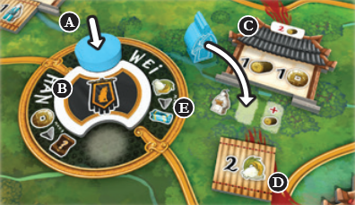

## Overview

The warring states period in Chinese history, where 7 warring kingodms were locked in conflict with each other, and also nomadic tribes that attacked from the north. The game is played over 4 rounds, in which we'll be installing governor to regions, bolstering the power of ruling houses, and selling goods to gain wealth. While we're doing all this we must keep a constant watchful eye on the fortifications protecting us from the nomads to the north. Each round the nomads will advance towards the borders of the 7 kingdoms in greater numbers, and when they reach a border a battle that affects all players is triggered.

The maps has several regions that  are used during taking actions. At the top are the nomads and military fortifications, below the map with the regions where we can install governor, trade, and improve standing, below that the barges where we will gain resources, and at the bottom the palace where there are different tracks for several influential powers.

## Game Phases

The game is played over 4 rounds, each broken into 5 phases:

1. Setup
2. Income
3. Action
4. Attack
5. Cleanup

### Setup

Bonus tiles are added to the round track. Bonus tiles are also littered around the board. There are 2 different kinds. Figurines and one time use. One time use tiles go on your board and you can use them as a free action at any time on one of your turns. Figurines are added to your player board's left side. There are 6 different ones, you can never have duplicates.  They allow you to spend coins to go up tracks when you pass, and also get you end game points

Nomad attack card is revealed and the strength of the armies is adjusted for the round. Each of the 4 nomads has a strength tracker that looks like a sword next to its regeion. If the meeple reaches the attack symbol at the bottom of the track, a battle will occur at the end of the round. This means we will be able to see where there will and won't be battles at the top of the round.

We will skip over income phase for now, and talk about the action phase

### Action Phase

Starting with the first player and continuing in turn order, each player takes a turn until everyone has passed. You have 3 action markers to use, but not all types of turns use an action marker. On your turn you resolve one of these types of turns which are all covered on the player aide:

1. Region
2. Military
3. Barge
4. Pass

#### Region turn

This type of turn takes place on the map section of the main board.

The circular space in a region is where you'll be placing your disk. If there are other disks there, you must pay 1 money to the supply per disk, and then your disk goes on top. Then in any order:

- Advance one step on the palace track matching the banner color in the region and possibly gain benefits
- Gain any extra benefit shown in a bubble (only in some regions)
- Take one of each type of possible action in the region. Taking an action in the region is optional, but you must resolve at least one

1. Install a governor

- Select a abuilding in the chosen region that has an available meeple space. Pay the depicted wood cost shown at the top of the building, and any additional wood shown in the space where you'll be putting your meeple. If there is a bonus tile, grab it.
- Buildings are either red for a passive bonus, or grey for an income bonus. If you put a governor at an income building, you will also immediately receive the resources shown.

2. Exchange

- Some regions have goods conversions listed next to the name of the region. You can perform the listed conversion up to 4 times.

3. Shipping

- Allows you to trade with a ship in the port of that region
- Only available in regions that contain ports
- Place a shipping marker (rope pretzel) in the port area
- You may place as many delivery markers (player color crate) as there are availalbe spaces on the ship (as long as you can spend the goods)
- To make a delivery you must spend the good indicated on the port demand tile (shown as a neutral crate on the ship) and possibly additional goods
- You place your player color delivery token to cover a bonus space at the bottom of the ship, also receiving that benefit.
- The ship next the wave symbol is not in any port. You can't normally deliver here unless a game effect allows you to.

#### Military turn

This type of turn takes place in the wall section at the top of the board where you will take your choice of 1 of 2 actions

- Place your action disk on one of the spaces, paying one coin for additional disks present
- Go up one space on any palace track

1. Fortify

- You may build as many walls and towers as you want (and are able to pay for)
- Spend a number of stone depicted next to each wall and or tower on your player board ( you must build both in ascending order)
- Walls get placed on the leftmost empty space of any wall section on the main board, towers have a dedicated space.  Move the defense marker in that wall section up twice for a tower and once for a wall.
- In a single action you can distribute built structures across multiple wall sections

2. Train soldiers

- You may train as many soldiers as you want (and are able to pay for)
- Pay 2 rice per soldier and then place a meeple from your supply  in the leftmost empty space in any wall section.
- In a single action you can distribute soldiers across multiple wall sections.
- Move the defense marker up 1 per soldier

#### Barge Turn

This type of turn takes place in the river section of the board, and does not require using an action disk

- Select a barge and pay a coin. Additionally, pay 1 coin for each of your workers already present on the barge.
- Place your worker on the leftmost position of the barge and gain 1 of the resource depicted.
- Any workers on the barge are pushed to the right. Only 3 workers can be on a barge. A knocked off worker is moved to that player's board into one of the merchant spots.
- During the income phase you gain 1 of the indicated resource per worker on a barge.
- If you are out of your own player color workers, you may instead place a gray neutral worker. Cost is paid normally, and the resource is gained immediately, but neutral workers will not generate any income.

#### Pass turn

When you pass, resolve the following steps in order:

- Place your turn ovrder marker on the topmost empty space on the turn order tracker for the next round
- Take an available bonus tile below the round track
- Spend coins based on the amount of figurines you have to go up on palace tracks (can be different)

#### Free actions

On any of these turnes, you are also able to take any free actions:

- Discard an action marker to gain 2 coins (it will come back next round)
- Us a bonus tile (keep it face down near your board, may matter for end game scoring)
- Discard an objective card to gain all the benefits shown on the top part of the card
- If your merchant action spaces are full, you may return meeples to your supply to carry out the action shown
- You may just return a meeple from a merchant space back to your board 

### Attack phase

After all players have passed we check the position of all nomad meeples. If a nomad has reached the final space, a battle is triggered in that region following these steps:

1. Award prestige

- Sum up the strength of each player that contributed to the defense of that wall. Towers count as 2, walls and soldiers count as 1 each.
- Player with the most strength gets 7 points, second most gets 4, and third most gains 2. Ties are broken by leftmost soldier, then leftmost wall

2. Battle

- For every tower in a section, the nomad strength is reduced by 2, for every wall by 1. If nomad strength reaches 0, the battle is won.
- Starting with the leftmost soldier, return soldiers to the respective players supply, one by one. For each removed, decrease nomad strength by one. If nomad strength reaches 0, the battle is won.
- Each soldier returned to a player gets them 1 point.
- If the nomad strength is still not 0, they raid the lands in their lane.
    - Move the nomad along the path to the first building tile
    - Return governors from that building back to the players supplies
    - Add an additional cost token to that building, and replenish the bonus tile space if empty
    - Decrease the nomad strength by the number printed below the building. If the nomad strength reaches 0, the battle is over.
    - If nomad strength still remains, move to the next building and the process is repeated
    - If all buildings were raded and the nomad strength never hit 0, all players either lose 1 coin or 3 points PER NOMAD STRENGTH REMAINING
- If the battle was won, the player that gained the most points during the first step of the attack gains 1 additional point for each governor (regardless of owner) remaining on the attacked path
- At the end of the battle, return the nomad to the start of its track and reset the strength accordingly. Reset defense accordingly.

### Cleanup

- Bonus tiles remaining below round track are returned to box
- Each player takes back action markers
- All ship tiles with all delivery spaces occupied are discarded
- Ships are slid up, new ships are revealed in empty ports
- Turn order slides over

### Income

I said we'd come back to this! In the income step you gain income from these sources:

- Income buildings on the main board and player board
- Workers on barges

## End game scoring

Game ends after end of 4th round. Gain points for:

- Figurines
- Placement on palace tracks
- Up to 3 objective cards left in your hand (if multiple cards care about the same components for conditions, they match for all objectives. So friendly, not like great western trail)
- Add up all money, resources, and goods, divide by 5

