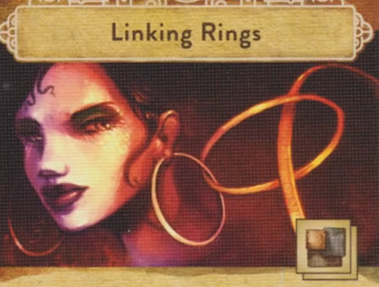

## Overview

We’re rival magicians. The famous magician Dhaalgard is retiring, and we have 5 weeks to prove to him that we’re the best magician around and most worthy to inherit his secrets, including the trickerion stone, rumored to give Dhaalgard supernatural powers

At it’s core, this is a worker placement game

Over the course of the game, you’ll:

Buy tricks (Yellow downtown)
Buy the stuff we need to perform them (Orange market row)
Practice the tricks (Red workshop on playerboard)
Stage them in the theater (Theater), and then perform them for fame points

At the end of the 5th week (round), whoever has the most fame wins

## Setup

There's some stuff to do as setup that we'll come back to after the game makes more sense, and there is a suggested beginner setup if we don't want to make a ton of choices of the jump

We'll start the game by picking magician that prefers on of the 4 schools of magic:

Mechanical (gear)
Spiritual (swirl)
Escape (chain)
Optical (eye)

Everyone has to pick a magician from a school that has not been chosen yet.

We'll get the following:

- Magician Card (goes on bottom left of playerboard)
- Magician's poster (small card goes off to the side)
- Starting trick of your choice in your preferred school of magic
- Set of assignment cards
- Components of your choice worth no more than 2 coins

If you've started the game with all the components that your starting trick requires, you get to set it up for free now.

We'll also start with a specialist assistant that will give us another bonus:

- Starting with an additional component worth up to $2
- Starting with an additional trick
- Starting with an additional worker to place out who works for free

We'll start with worker disks to place out:

- Top hat is your magician
- Glove is an apprentice
- Then you'll also get a disk for the assistant you chose (an an additional apprentice if you chose that starting assistant)

## Round Structure

### Start of the week

- At the start of every week, we’ll roll these 6 dice and place them on the square spaces in the Downtown (Yellow) area
- Starting with the second week, we’ll rearrange the turn order track:
    - Lowest fame is top of turn order, down to highest fame in bottom of turn order
    - In the case of a tie, just swap turn order for the tied players from the last round so that whoever was higher last week is now lower
- You can then advertise, to gain 2 fame. You place your poster (small card) on the turn order slot you occupy, paying the cost in money depending on your slot

### Placing workers:

You have a minimum of 3 character discs that are workers you can place in 4 different places around the main board.

- Downtown: Where you get new workers, money, and tricks
- Market Row: Where you buy materials to practice tricks
- Workshop (your playerboard): Where you actually practice your tricks
- Theater: where you stage (heh) and perform your tricks

#### Action Points

- Each character disk has a half circle on the bottom w/ a value and lightning bolt. These are action points.
- The board has circular areas where you can place your character discs. Each space has a small number below it, which represent action points as well. 
- The more action points, the more stuff you get to do
- Action points are cumulative, so placing your magician disk (the 3) on top of a spot with a 2, means you get 5 action points to spend in that space

#### Action programming

To decide where your workers will go, you have to set them in advance with your assignment cards

- You do this by placing an assignment card face down below each character disk
    - So if you want your magician to go to the market row, you would put your market row card beneath that worker on your playerboard
- This process is down simultaenously (and since they’re played face down, secrectly)
- Everyone will flip and reveal
- A disk without a card played under it will not go anywhere that round

In turn order, we will take turns placing one character disk out onto the board into the area matching their assignment card

- You will do the actions of the space you place your worker when placed
- After that the next player in turn order will place one worker on the board and do things
- We'll keep doing this until all workers are placed
- Using characters like this will cost you wages at the end of the round

If you decide you don't want to send one of your workers out

- Maybe you're going broke, or none of the action spaces left in that area are worth paying wages for
- You can treat a character as idle and just flip over their assignment card instead of placing them
- They will not be activated this turn, but you will not have to pay them

### Action Locations

#### Downtown 

(Where you get new workers, money, and tricks)

- Learn a trick (top middle): 3 action points
    - Grab a trick card if it’s category matches one of the die faces
    - You can also grab a trick of your magician’s preferred category
    - So if a trick category is not your preferred type, or not shown on one of the die, it cannot be selected
    - Cards have a fame threshold in the bottom right, which you must meet to be able to learn a trick. This value will either be 1, 16, or 36. (Easier to call it a level 1, 2, or 3 trick)
    - You must have at least this many fame points to learn a trick, but if you fall short, you can pay the difference in coins
    - You DO NOT have to pick the card off the top of the pile. You can dig through that deck and grab whatever trick you want
    - If you grab a trick that matches a die face, you then flip the die to it’s X side
    - If you grab a tick that matches your preferred category but not one of the die, you choose which die to flip to the x side
    - The trick goes into your workshop, and you assign one of your symbol markers to it (the solid card suit token w/ no magic category symbols). If you are out of slots in your workshop, you can always remove a trick from there. You then remove all associated tiles and return the trick to the downtown board
- Hire another character (top left): 3 action points
    - Available characters are shown on the dice
    - Just like getting a new trick, if you get a new character, flip the corresponding die to it’s x face
    - Place the new character disk on top of the one that you used to buy it so you don’t get mixed up with it on your player board as they're not available to use this round (also means you don't pay them this round)
    - You can only hire one of each specialist
- Withdraw money from bank (top right): 3 action points
    - Choose the amount you want, gain it, then flip the die to it’s X face
- Reroll die (bottom right): 1 action point
    - Reroll any one die in this area
- Set die (bottom left): 2 action points:
    - Set a die to whatever face you want in this seciton

#### Market Row 

(Where you buy materials to practice tricks)

Trick require materials to perform them (show cost on a trick)

So this trick requires you to have 2 pieces of metal

- Buy material (furthest left): 1 action point
    - Choose an available component, and buy up to 3 instances of them
    - Materials have a dot on the bottom (and all share a color) for how many coins each material is. One dot equals one coin each, three dots equals 3 coins each
    - The board basically represents the catalog of available goods. When you buy components, they are not removed from the board, but gained directly from the supply
    - You can only own up to 3 of each type of component. They’re stored on your board and stacked by type
    - When you buy, you can spend extra action points to bargain the price down. This is attached to the same ation space and costs 1 action point.
    - This does not decrease the price per unit, only the overall price
    - Can’t bargain down to zero, will always pay at least one coin
- Slow order for the market (far right): 1 action point
    - Goods queued up with this action will appear in the store next week
    - Place the new component on the board. The slot it is placed in is the component it will replace when it arrives in the shop
- Quick order for the market (middle): 2 action points
    - Goods selected with this action will be available for immediate purchase
    - Place the new component in the single slot, replacing one already there if applicable
    - The component is now available to purchase this week
    - Items in the quick order slot cost an extra coin per unit to purchase
    - The quick order slot gets cleared out at the end of the week

#### Workshop 

(your player board) (Where you actually practice your tricks)

- Preparing a trick
    - When you place a disk here, if you own all the components a trick requires (and in the right quantities), you can then prep the trick.
    - You spend the action points shown on the trick, then populate the trick with the trick marker tiles equal to the number shown on the trick (stacked squres) (matching the suit of the symbol marker placed whenever the trick was originally gained).
    - If there are already markers on a trick, you can’t prep it
    - With the setup for the beginner game, our starting trick is already prepped
    - When a trick is prepped, it just checks to see that you have the components, they are NOT consumed
- Specialists (your side board)
    - These are chosen during set up, or beginner game setup has assigned us all one
    - Each specialist has a unique action you can take (they are conveniently not named on the cards)
- Engineer (wrench)
    - Allows you to move a trick from your board to hers for 1 action point (or exchange tricks already in her slot)
    - If you prep a trick on her board, you get one bonus trick marker
- Manager (stopwatch)
    - Allows you to move components to his card, or swap them with components on your board
    - Components here are treated as having a bonus one for free. So if there are 2 glass on him, it counts as 3 glass. So if this is the case you couldn’t buy more glass, because the component limit is 3
- Assistant (bow)
    - Extra slot for an apprentice (another character/worker)

In any of the 3 major locations we’ve talked about, Downtown, the Market row, and the workshop, you can spend one trickerion shard when you place your character for an extra action point. You can not do this in the…

#### Theater 

(where you stage (heh) and perform your tricks)

- The theater represents various different theaters, think of it as one of many buildings that you can perform magic
- Placement circles are grouped in column by day (listed at the bottom of the row)
- If you place a character in a certain day’s slot, you have locked that day down, and no other player can place a character in that column for the rest of that week
- Any other characters you place in the theater have to be placed into the column you’ve already placed in, so no double dipping
- Again, you can’t spend trickerion shards here for action action points like in the other locations
- Top hot slots are for placing magicians only

- Staging a trick so that it’s ready to perform (top left): 1 action point
    - You spend one action point to move a trick token from your workshop to one of the performance cards
    - Think of these cards as playbills that list the various trick that will be performed in a single show
    - Each trick you stange on a card must be unique, so you could not have multiple of the same trick token (because these would be from the same trick)
    - When you place the token, the corner representing that trick’s category of magic must be touching one of the circles on the card
    - If you stage a trick so that the symbol inside the circle lines up with another trick, those tricks are now linked
    - This gets your extra fame or coins (left reminder card) depending on the level of the trick
    - If there is a trickerion shard in the circle where this occurred, any player with a trick token in there gets one shard. If both tricks are yours you still only get one shard
- Reschedule action (top right): one action point
    - Lets you move an already placed trick token to an empty space on a card (either the same card or a different one)
    - If you link tricks while doing this, they don’t count for any bonuses we just talked about
- Magician only performance slots (time to put on a show):
    - New phase that happens after all characters have been placed and all turns are over
    - Turn order is ignored for resolution of this phase, we go left to right by day in the theater columns
    - A player gets to choose a performance card that has at least one of their trick markerst on it to perform and performs that show
    - Every trick on the card will be performed, whether it belongs to you or another player
    - Players will earn the fame and coins from their corresponding tricks in that show
- Yield modifiers
    - Some days are better or worse to place on. 
    - Thursday has a negative modifier of minus one coin and minus one fame
    - If you place any worker in the Thursday column, and any of your tricks get performed in shows at any time that week, you receive the negative modifier for any rewards of those tricks. You can’t go into the negative
    - Conversley, Sunday gives you a positive modifier for any of your tricks performed on any day
    - So thursday gives you bonus action points, but a worse yield modifier, where Sunday gives you less action points, but a better yield modifier. Friday and Saturday both give no bonus to action points or yield modifier.
    - If your trick gets performed, but you have no characters in the theater, your yield modifier is the same as the performing magicians
- Performing magician bonuses
    - Why perform the show if everyone’s tricks get payed out you ask?
    - The right reminder card shows the bonuses the performing magician gets
    - 1 fame for every trick link in the show
    - The reward shown if you have that additional character “backstage” in that column
    - Whatever bonus is listed at the bottom of the performance card
    - When a trick is performed, the marker is removed from the card and returned from the player’s supply, NOT back to the trick card

## ROUND END

- Wages
    - When the weeks performances have ended, you need to pay wages
    - The slot for that token on your board shows what you have to pay (if you used that character this round)
    - If you can’t pay, you lose 2 fame for each coin you can’t pay in wages
    - You have to pay if you can
- Clean up 
    - Take character disks back from the main board
    - If anyone was hired, add them to your board
    - Any goods in the ordered area of market row replace the appropriate goods
    - Any quick ordered goods are removed
    - Performance cards move forward like a conveyer belt, and a new one is flipped from the deck into the empty slot
    - A performance card is removed from the game when it falls off the conveyor belt, and any trick tokens still on it are returned to the players supply
    - Everyone who advertised gets their poster back
    - Round counter advances
    - Reroll and place dice
    - Take your assignment cards back
    - Time for another week

## END GAME

- 1 fame for each leftover shard
- 1 fame for every 3 coins
- 2 fame for each apprentice
- 3 fame for each specialist
- Initiative order breaks ties

Dark alley

- 2 fame per unused special assignment card
- No longer get fame for specialists

## Dark Alley "expansion"

- New area of the board
- Prophecies are in this crystal ball
- Speical assignment cards that give you new abilities
- Our magicians now how asymmectric powers
- New level 3 tricks that grant end game bonuses

- Draw top card of special assignemnt deck (leftmost, 1 action point)
    - These cards are used just like your regular assignment cards, except they're single use
    - Instead of using it for it's ability, you can use it for +1 action point
    - All played special assignment cards are lost at the end of the round
    - If you flipped your card face down to idle a character, the card is not lost
- Draw additonal special assignment cards (middle, 2 action points)
    - 
- Rotate the prophecies
    - At the end of the round the top left prophecy will become active
    - This action lets you change which one will become active next
    - The active prophecy will pretty much break a game rule for the round while it is active