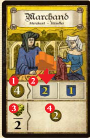

## Overview

We're rich families from the champagne region of France fucking with the different types of people in town

- Red: The military, let you repel invaders easier
- White: The clergy, contribute to building a cathedral and educating other citizens
- Yellow: The peasants, toil to fill your coffers (that means make you money)

The people of the city make up the workforce that is represented to us by dice. It will cost groups of dice to take actions

## Setup

We'll be putting some citizens (meeples) on the map to get our starting positions, but we'll get back to that after we know what we're doing

- Citizens in the civil (yellow) building will get you one yellow die each, and cost you no money
- Citizens in the religious (white) building will get you one white die each, and cost you one money each
- Citizens in the military (red) building will get you one red die each, and cost you two money each

Citizens will get knocked out of these buildings. Yellow and white will happen in rows, with the rightmost falling off

The red building will see citizens get knocked out based on die value

## Board overview

In the center of the board we've got an area broken up into a district for each of us, and a neutral district

We've got a color coded set of activity cards next to each of the cooresponding building types, the cathedral next to the white activity cards as well

At the bottom of the board we've got where the event cards will come out

## Round overview

We'll play over a set number of rounds (5 in a 3 player game, 6 in a 4 player game) with a number of phases in each

- Reveal activity cards
- Get income
- Assemble workforce
- Events
- Actions
- End of round

### Activity cards

We'll start by revealing activity cards

- Flip over an activity card in each color corresponding to the current round
- Since there are only 3 cards for each color, we'll only reveal new activity cards in the first 3 rounds
- These cards will give actions specific to their color building

### Income and salaries

- Each player gains 10 money
- Each player pays money based on citizens currently in buildings
    - 1 money for each citizen in the religious building
    - 2 money for each citizen in the military building
- If you can't pay, you pay all that you can and then lose 2 victory points

### Assemble workfoce

- For each citizen you have in a building, you'll gain a die of that color
- Roll all your die, and then put them in your district in the center of the board
- We also assemble die this way for the gray neutral citizens, placing them in the neutral district after they're rolled

### Events

- We'll flip over 2 event cards to add to the event row next to the one printed on the board
- The first card will be from the red deck, and it'll tell us to flip either a white or yellow to go with it
- We will then resolve all active events from left to right, starting with marauding (the one printed on the board). What we're resolving is at the bottom of the card in the banner.
    - Non dice events are resolved first
    - Then grab the indicated number of black dice for other events and roll them
    - The start player then must counter the highest black die with dice from their district
        - A player can use dice of any color from their district to count a black die, the pips must just add up to meet or beat the black die value
        - Any red die used count for double their pip value
        - A player can counter several black dice at once, the highest value, plus any other they choose
        - A player gains 1 influence for each die they counter
    - After the start player counters the highest die, the next player in turn order must counter the next highest and so on until all black dice have been countered
    - If a player's dice don't allow them to beat the highest black die, the black die is discarded and they lose 2 influence

### Actions

- Beginning with the start player and going clockwise, each player can perform 1 action using the workforce or pass
- Each action requires using a group of 1 to 3 dice of the same color, and those dice can come from one or more of the cities districts
- Lets pause a second to talk about what that means, because it's a big part of the game
    - You can use other players dice to perform your actions! You pay them money based on how many dice you are using for your action.
    - If you're using 1 die for the action, it'll cost 2 money if coming from another player
    - If you're using 2 die for the action, each die from another player costs 4 money
    - If you're using 3 die for the action, each die from another player costs 6 money

Now on to the actions

#### Activate an activity card

You will need to spend the appropriate color die to interact with a card (find the yellow marchand card to use as an example)

First off, you'll have to have a tradesman on a card to interact with it. 