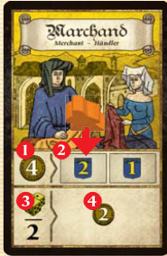

## Overview

We're rich families from the champagne region of France fucking with the different types of people in town

- Red: The military, let you repel invaders easier
- White: The clergy, contribute to building a cathedral and educating other citizens
- Yellow: The peasants, toil to fill your coffers (that means make you money)

The people of the city make up the workforce that is represented to us by dice. It will cost groups of dice to take actions

## Setup

We'll be putting some citizens (meeples) on the map to get our starting positions, but we'll get back to that after we know what we're doing

- Citizens in the civil (yellow) building will get you one yellow die each, and cost you no money
- Citizens in the religious (white) building will get you one white die each, and cost you one money each
- Citizens in the military (red) building will get you one red die each, and cost you two money each

Citizens will get knocked out of these buildings. Yellow and white will happen in rows, with the rightmost falling off

The red building will see citizens get knocked out based on die value

## Board overview

In the center of the board we've got an area broken up into a district for each of us, and a neutral district

We've got a color coded set of activity cards next to each of the cooresponding building types, the cathedral next to the white activity cards as well

At the bottom of the board we've got where the event cards will come out

## Round overview

We'll play over a set number of rounds (5 in a 3 player game, 6 in a 4 player game) with a number of phases in each

- Reveal activity cards
- Get income
- Assemble workforce
- Events
- Actions
- End of round

### Activity cards

We'll start by revealing activity cards

- Flip over an activity card in each color corresponding to the current round
- Since there are only 3 cards for each color, we'll only reveal new activity cards in the first 3 rounds
- These cards will give actions specific to their color building

### Income and salaries

- Each player gains 10 money
- Each player pays money based on citizens currently in buildings
    - 1 money for each citizen in the religious building
    - 2 money for each citizen in the military building
- If you can't pay, you pay all that you can and then lose 2 victory points

### Assemble workfoce

- For each citizen you have in a building, you'll gain a die of that color
- Roll all your die, and then put them in your district in the center of the board
- We also assemble die this way for the gray neutral citizens, placing them in the neutral district after they're rolled

### Events

- We'll flip over 2 event cards to add to the event row next to the one printed on the board
- The first card will be from the red deck, and it'll tell us to flip either a white or yellow to go with it
- We will then resolve all active events from left to right, starting with marauding (the one printed on the board). What we're resolving is at the bottom of the card in the banner.
    - Non dice events are resolved first
    - Then grab the indicated number of black dice for other events and roll them
    - The start player then must counter the highest black die with dice from their district
        - A player can use dice of any color from their district to count a black die, the pips must just add up to meet or beat the black die value
        - Any red die used count for double their pip value
        - A player can counter several black dice at once, the highest value, plus any other they choose
        - A player gains 1 influence for each die they counter
    - After the start player counters the highest die, the next player in turn order must counter the next highest and so on until all black dice have been countered
    - If a player's dice don't allow them to beat the highest black die, the black die is discarded and they lose 2 influence

### Actions

- Beginning with the start player and going clockwise, each player can perform 1 action using the workforce or pass
- Each action requires using a group of 1 to 3 dice of the same color, and those dice can come from one or more of the cities districts
- Lets pause a second to talk about what that means, because it's a big part of the game
    - You can use other players dice to perform your actions! You pay them money based on how many dice you are using for your action.
    - If you're using 1 die for the action, it'll cost 2 money if coming from another player
    - If you're using 2 die for the action, each die from another player costs 4 money
    - If you're using 3 die for the action, each die from another player costs 6 money

Now on to the actions

#### Activate an activity card

You will need to spend the appropriate color die to interact with a card (find the yellow merchant card to use as an example)

First off, you'll have to have a tradesman on a card to interact with it. 

- If you don't have a tradesman on the card:
    - Top left of the card shows the cost to put a tradesman on it
    - The tradesman must come from your supply or from any location on the board (other cards, buildings, or expelled citizens)
    - If none in your supply, you can hire one for 2 influence (the track at the top, more on that later)
    - Tradesman goes on one of the slots for points, or if those are full, on the illustration
    - Everyone can have only 1 tradesman on a card, no limit to number of players that can be on the same card
    - If a tradesman is moved from a point slot, that is now an available slot for the future. Other tradesman on the card are not re-arranged to take the psot
- If you already have a tradesman, just activate the card

- To activate the card, use a group of 1-3 appropriately colored dice.
- Bottom left of the card shows what to divide by. So if you use a 6 value dice and the card shows divede by 3, you get to do the action of the card twice
- Some cards have immediate effects, others (denoted by an hourglass) have a delayed effect. Instead of taking the action a number of times, you'll place a number of cubes on this card. 
- You can use these cubes later to modify an action, but you can only use one cube per action
- You can't use a cube to counter black dice in the event phase

Tradesman in point spaces on cards will award end game points.

#### Construct the Cathedral

Use a group of white dice to work on the cathedral. Each die allows you to place one cube on the same numbered construction site.

- This area is divided into 3 rows
- Each space can only hold one cube
- In order to place a cube into the second row, there must be a cube below it already
- For die spaces 1-3, you'll gain 1 point and 1 influence every time you place a cube
- For die spaces 4-6, you'll gain 1 point and 2 influence

At the end of the game, for each row that you don't have a cube, you'll lose 2 points

#### Combat Events

Use a group of red dice to combat threats to the city

- Event cards are at the bottom of the board
- An event card will show you what color dice you must use for it
- It will also show how many cubes to place (total value of dice / shown number, rounded down)
- Each banner space can hold one cube
- Gain one influence for each cube you place
- When all spaces are filled, the event is countered
    - The player who placed the most cubes on the card receives the highest VP total
    - 2nd highest gets lower value
    - Lower placements than that get nothing
    - If only one player had cubes on the card, they get both VP totals
    - Tie for first sees the tied players receive half of the sum of all points rounded down
    - Tie for second sees the tied players receive half of the lower value, rounded down

#### Place a citizen on a building

This is how you get citizens on buildings to get more die at the start of the round

- This action only uses 1 die
- Take a citizen from your supply (or anywhere else on the board), or hire for 2 influence
- Place that citizen on the building matching the color die that you spent
- The value of the die shows the location in the building where they are placed
- For the white and yellow building, a citizen is placed on the farthest left space of the matching row
    - If the row is full, they all slide over to make room, knocking the rightmost citizen off of the space
    - Lay the citizen down to the side of the building
- For the red building, a new citizen goes on the matching space
    - If there is a citizen there already, remove it and lay it down to the side of the building

If you already have a citizen of your color laying down on a building, another player can not take an action that would expel a 2nd one of your citizens. 

Knocked out citizens will return to players at the end of the round

#### Use agriculture space

This tiny, missable spot allows you to just gain some money. This activity requires no tradesman and just gives you coins equal to the pip value of die used diveded by 2.

#### Pass

If can't or don't want to take any action, you can pass. When you still have dice available and you pass, you get 2 dollars.

This is a hard pass, but every time you would have another turn this round, get another dollar. All money from this passing is put in your district on the main board to remind people that you have passed

### End of the round

if all other players have passed (so there is money in everyone's disctrict)

If there are no more dice on the board

The round then ends

- Players get the money from their districts
- Citizens laying down are returned to players supply
- Unused dice are returned to the supply
- Start player card rotates clockwise

### Influence

There's a track at the top of the board that tracks influence that can be used in different ways

- 1 point: reroll a die from your district
- 2 points: add a citizen from the general supply to your personal supply
- 4 points: turn over 1-3 of your die to show their opposite face. The dice chosen may be of different colors

### End of the game

In addition to VP earned during the game, each player gets points for the following:

- 1 VP per un countered event card with a player's cube on it (including printed card on board)
- VP for citizens on activity cards
- Lose points for white building rows without a cube
- Points for character cards

