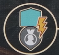

## Overview

!!! note
    We are members of a psychological society started by Sigmund Freud devoted to psychoanalysis (or study of the unconscious mind). 

    As members of this society, we aim to come up with new therapeutic techniques, grow our clientele, and become Freud’s most distinguished contemporary. To do this we will discuss ideas with peers, compile notes, and publish theory. To do all this we’ll also need a lot of coffee

The game is played over a number of rounds until Freud's reputation marker moves onto the end of the reputation track, triggering the end of the game. On your turn, you will choose one of 3 options:
- State Ideas
- Recall Ideas
- Treat Clients

## General Concepts

### Insight

Each player has a large wheel to track their insight. The wheel has different wedges for the differet insight qualities, as well as different rings for the insight levels.

There is a center reserve, where generated insight is pulled from. While in the reserve, insight has no quality or level. You will start the game with only white insight, but can add ones of your player color throught the game.

To generate insight (gesture to symbol), move from your reserve to the cooresponding area. If none in reserve, you can pull any insight of board to use to generate the new one instead.

Effects that look like arrows will let you move insight, or change levels. When increasing level, you can't go from 0 to 1. When decreasing level, you can go from 1 to 0.

To pay insight, move it from the idicated area to your reserve. You can always use a higher level insight of the same quality to pay for a cost. So you could pay a minor insight by using a median insight of the same color.

There are generic colorless insight shapes that refer to any insight of the depicted level. There is a spot on your playerboard where you can trade a minor, median, and major insight for a heart shaped box.

### Reputation

On the city board is a reputation track that does two different things. Any time a player one goes up, so does Freud’s. Him reaching the pocketwatch triggers the end of the game. Finish out round + one more. Gaining reputation advances the clock of the game, no matter who does it.

When you gen a reputation (looks like a medal), first move Freud’s marker and then yours. If any marker crosses a line with the little face on the track, this make’s Freud’s meeple move locations, and this can happen multiple times in a turn.

This icon triggers the reputation track. When this happens you score points/coffee show at the zone above the track in the section where your marker is.Then look at the zone below the track. You can perform any one action from Freud’s section or lower.

!!! note
    Just remember, gaining reputation and triggering the reputation track are different things.

### Resources

 Two major resources on playerboard. Heart shaped boxes are mainly used to cure clients. Conversions in middle of board. Coffee is used for a lot, there are conversions in the bottom left of the playerboard. When you would downgrade and insight, you can pay a coffee to ignore it. You can pay 2 coffee to level up an insight or change it’s color. Coffee can also be used to gain a bright idea token, which we’ll talk about more.

## Major Actions

On your turn, you can do one of three options. The first is to state ideas. This is how you take the main actions in the game

### State Ideas

Ideas are the little speech bubbles in the bottom left of your playerboard. To perform this action you will grab 1 or 2 ideas and place them onto an empty idea space on the meeting table, pointing the tail at the action you want to perform. Placing one idea lets you do the action once, 2 ideas lets you do it twice. You can’t point the tails at an action that you have other ideas pointing at already.

You can substitute a bright idea for an idea token. You could even use 2 bright ideas and no idea token. These will go back to the supply at end of turn, where normal ideas stay on the meeting table. After performing your actions, you advance your inkpot

### Inkpot

Your inkpot will move clockwise along it’s track equal to the value shown on the row of the meeting board where you took your action, performing the inkpot effect where it ends movement. Bottom left of playerboard reminds you that for each bright idea token spent, you can modify this moevent +/- 1, down to a minimum of one.
- Three spaces aligned with insight will generate the insight shown, and then resolve the effects of every notebook tile in that row in any order. If the token has been removed from the end of the row, you will get the effect shown there too.
- Space on the left activates reputation track (not gain rep)
- Top space of the 4 stack has you pick a column with no idea above it, and then resolve every notebook tile in that column. If the token has been removed from below the column, get the effect show there as well.
- When you move your inkpot over the printed gain idea symbol, remove the leftmost idea token and add it to your reserve

## Meeting Table Actions

- Left lets you perform 2 elevations and 1 transfer (in any order)
- Right lets you generate one minor insight of each quality

Pay coffee to gain notebook tiles
- Left: Grab the tile from above the column
- Mid: Grab the tile from above column and activate banner effect before placing
- Right: Grab the tile from above column, activate the banner effect and then activate the main effect
- Tiles get placed into leftmost empty space of any row on the playerboard, banner side facedown
- Third tile in each row has a cured client requirement. First symbol requires 0, then 1, then 2
- Tiles slide down to fill. This happens immediately so you always have 2 to choose from
- When a row or column is completed, remove the insight and add it to your supply

- Right: draw the top card of the research deck. Then you may swap any card in your hand w/ any face up card in the display
- Left play up to 2 cards or publish a treatise
    - Cards stay in front of you after resolved, location tags on them now count
    - Treatise: to do this you must have a player colord insight on your dial. All of the treatises in the display are available, pick one to publish
        - You can use your own research cards and cite other players research cards to supply all the needed color cards, but the leftmost card with the icon must come from your played cards. You will lose access to any tags on cards that come from your played cards.
        - Once all cards are gathered, arrange them in the correct order and place the tile over them. Remove a player colored insight from your dial, placing it on the tile. Score the points in the center. Location tags on the tile are now yours.
        - To cite research from another player, grab the rightmost card from one of their treatises and add it to the cards you're collecting for the treatise. They receive 2 points and a bright idea. Can take multiple cards from the same player, and can take from multiple players, but you can only take the rightmost card, not leaving any gaps.

These actions let you move around the city. The city is divided into 3 districts with 2 locations in each district, identified by tags. Each location may hold any number of figures.

1. 3 possible location effects, applied when you move to that location
2. Each location has 3 bonus slots
3. Each district has 4 bonus slots

- Left action: Move your professor up to 2 locations clockwise around city, or move them to the same location as Freud. If you choose the latter, you must start in a different location that Freud.
- Right action: Right action: Move Freud up to 3 spaces clockwise.

After moving yourself or Freud, you will resolve the effect of the location where that figure ends up to a maximum of 5 times. To determine this, either count:
- Number of figures in that location
- Number of that location’s tags you have

There is a reminder in the middle of the board that you can spend a bright idea to get 2 extra actions here, but whatever combination you pay, the max is still 5.

## Recall Ideas

Instead of placing ideas and taking actions, you can recall your ideas. You must have at least 1 idea on the meeting table to do this.
- Count the number of meeting table spaces you have ideas on and gain that amount of coffee.
- Remove all your ideas from the table and place them back in your supply.
- Then choose either the location with your professor or the location with Freud. You will then claim a location bonus or a district bonus.
    - Location bonus: Choose an empty location bonus slot and gain that effect. Then move the topmost token from that district’s color stack and place it on the option that you chose to cover it. Placing the token with the reputation icon earns you a reputation. 
    - District bonus: To do this you must have a player colored insight on your dial. Count the number of location tags matching the color of the district. Place your player colored insight marker on the number equal to or lesser than that value, gaining the bonus shown. Then move the topmost token from the district onto that slot.
- Once a district is out of tokens, no location or district bonuses can be taken there.

## Treat Clients

Instead of taking an action or recalling, you can treat clients. This is your office where clients and dreams will go. Dreams up top, clients on bottom. When you treat a client, you may treat one or both in any order one time each. To treat a client:
- Look at the effect of the topmost dream. You must pay the depicted insight.
- Resolve the effect of the dream. Heart symbols are therapy points
- For each therapy point, move the marker on that side of the office one space to the left
- If you move over the heart with a star symbol on space 3, immediately trigger catharsis and remove the grief layer (more in a moment)
- Dream card is then removed from the game.
- When gaining therapy points, if you hit 0, you have cured the client, more on that later.
- If you would gain “extra” therapy points pushing you into the negative, you gain that many heart shaped boxes.
- Some manifest dreams have a symbol in the top right. If that symbol matches the one of the client’s grief layer, you will gain a heart shaped box when resolving that dream.

### Catharsis

- Resolve the bonus on the top left of the grief layer card.
- Starting grief layer cards also show the grad cap symbol. Removing this grief layer unlocks your second office room.
- Removing the grief layer unlocks the abilities on the bottom of the card. Even though the client is not yet cured, this ability is now active.
- Points are only scored when client is cured.

When a client is cured, you move them to your tableau. Their ability and tags are still active.
- Routine clients provide passive bonus and tags
- Case study clients provide end game scoring
- All of these are explained on one of your player aides.
- If there are still any dream cards in your office when a client is cured, remove them. From the game.

### End of turn

- You may use heart shaped boxes to produce therapy points
- This can trigger catharsis or cure a client
- Take on a new client for each empty office room you have
- Take one of the patients from the display and add it to an office. Display is refilled immediately. 
- Draw a latent dream and put it in space above the client’s room
- Draw a manifest dream from the display or the top card of the deck. This display is refilled immediately. Place it on top of the latent dream.
- Place the therapy marker on the space matching the amount of green hearts shown on the card

## Location Goals

- 7 location goal tiles are between the main boards
- When you meet the condition shown on a tile, you must immediately claim it
- Gain the reputation, then place the tile face down in your tableau. Tags are now yours.

## End of game
- When Freud’s marker reaches pocketwatch, end of game is triggered.
- Player who caused this to happen gains 3 points. 
- Complete the current round, then one additional round. 
- In final round, you do not take on any new clients

### Scoring
- Score points shown on reputation marker space
- (shown on end of reputation track): Player who is furthest along the track scores 2 points for each of their completed treatises, and 2 points for each cured client. 2nd farthest on track gets 1 point for each. In case of a tie, the player on bottom is considered further ahead.
- Check number of districts with your colored insights. Score 4/10/18 points for presence in 1/2/3 districts (shown in middle of board).
- Count number of rows on playerboard that are full of notebook tiles. Score 1/5/6 points for 1/2/3 being completed. (shown on player board top right)
- Score points for unique location tags you have (shown on bottom of board)
- Case study cards
- Heart shaped boxes convert to 2 points each
- Coffee converts to bright ideas 3:1
- 1 point for each bright idea

