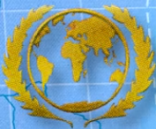
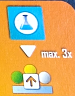
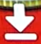
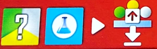
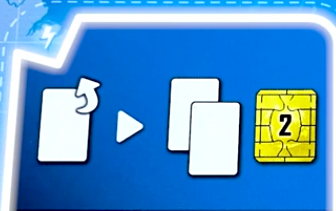
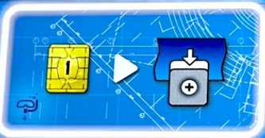
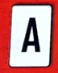

## Overview

The surface world sucks, so we're all building our own underwater cities that are going to be way cooler. 

We'll be taking actions and playing cards simulatneously to build domed cities, the buildings that support them, and tunnels to connect them together. 

Different parts of your city will get you points in different ways, and points is what it is all about

## Round overview

We'll each take one turn placing out a worker on an action space and also playing a card.

We'll go in the established turn order and each end up taking 3 turns in a round. At the end of a round we'll evaluate new turn order and move on to the next.

Once we reach the gear symbol on the round track we'll do a production round where we won't take turns but will all get to produce resources from the cities that we've been building. There are a total of 3 production rounds, with one being the final thing that happens before scoring.

## Turn overview

On your turn you will place a worker onto an empty action space and also must play a card.

- You will always do the action in the space you went to
- If the color card you played matches the color space you went to, you'll also resolve the card.
- Resolving cards will get you instant bonuses or add them to your tableau
    - Instant card effects can be applied before or after taking the action of the space you went to
- If your card doesn't match, you'll just discard it with no additional effect

Cards have different types of effects:

- Lighting bolt is instant bonus
- Infinity sign is ongoing passive bonus
- Stopwatch is end game points
- 3 gears means it activates during production
- Captial letter "A" is an action card that can be used once per round, but DOES NOT activate when played (more on this later)

Say it with me, playing an action card does nothing for you immediately

The action spaces are broken up into different colored sections

- Green action spaces are the worst value, but tend to have the best cards
- Red action spaces and cards are middle of the road
- Yellow action spaces are the strongest, but yellow cards are the weaker ones

Certain action spaces let you do multiple things, which you can do in any order. You can always choose to only do one thing in an action space, but must be able to do one of them. You can't go to a space where you can't perform any part of the action just to block it.

Action spaces with a slash mean you get to do one option or the other. Again, you must be able to do one

You'll always end your turn by drawing a card. You will always have 3 cards to pick from at the start of your turn. If you end your turn with more than 3 cards, you must discard down to 3 by the time your turn comes back around.

## Building stuff

Before talking about the actions, lets talk about the whole point of the game. Building your underwater city.

You've got a little reference card that shows you all the costs.

There are a few different resources:

- Kelp (green)
- Steelplast (white)
- Science (blue)
- Money (coins)
- Biomatter (pink, wild that can stand in for kelp or steelplast but not coins or science)

The leftmost side of your reference shows you the cost to build things (the down arrow):

- The tiny buildings cost one of their matching color resource
- Tunnels cost a steelplast and a coin
- Cities cost you 2 steelplasat, a kelp, and a coin
- Symbiotic cities cost you a biomatter, steelplast, kelp, and 2 coins

The next column of your player aide shows you what each of these buildings produce (the gears symbol)

- A single building of a given type produces the single resource shown
- A tunnel produces a credit
- A normal city produces nothing, while a symbiotic city produces 2 points

Some actions and cards will let you upgrade you tunnels and buildings to make them more valuable. The next column of your player aide shows what a single upgraded component produces instead of the basic one

- Upgraded farms gives you an extra point
- Upgraded desalination plants give you an extra biomatter
- Upgraded labs get you an extra steelplast
- Upgraded tunnels get you an extra point

The next part of your player aide shows what a pair of upgraded buildings at a single city will produce

- A pair of upgraded farms get you an extra kelp and point
- A pair of upgraded desalination plants get you an extra dollar
- A pair of updraded labs get you an extra steelplast

All of this only happens in the produciton rounds, which are after round 4, 7, and 10.

After producing resources, you'll also have to pay each city 1 kelp or biomatter. If you can't, you'll have to pay a point for each you can't feed.

## Building restrictions

There are some limitations to how you can build. You'll start the game with a city already built at the bottom right of your board.

- Any new city built has to be adjacent to an existing city
    - This can be orthoganal or diagonal
- When building a new city, you don't have to have it connect with a tunnel
- Cities not connected with tunnels will not produce any resources in a production round, they also don't have to be fed
- Tunnels can be built anywhere as long as you can trace a line back to your starting city. This can be through empty sites with no buildings
- Tunnels not adjacent to cities do not produce in a production round
- Covering up symbols with a tunnel or city gets you the covered bonus

Buildings go on the little circles around cities

- Buildings can be built around an existing city, or at an empty site where you could build a city.
- There are only 3 legal building sites at each city, the dashed line spot is an expansion space that can't normally be built on
    - The effects of some cards will let you build at expansion sites
- During production, only buildings surrounding connected cities will produce resources

There are also metropolis tiles on 3 corners of your board that you can connect to

- Blue underwater metropolis tiles get you immediate bonuses
- Brown metropolis tile gets you additional end game scoring
- These tiles must be connected to with tiles to activate them
- The brown metropolis requires 2 tunnels to bring online

## The action spaces

Lets go over what the iconography on the action spaces means. Most is pretty clear cut, but some involve things we need to talk about more

There's a turn order track split into 3 parts:

- Current turn order on the left
- Neutral starting point for each round on the bottom
- Track on the right that will determine turn order for the next round
- Each one of these symbols that you get will allow you to advance 1 on the rightmost part of the turn order track

- When you reach or pass a bonus, get it immediately
- If you're already at the top and would gain a movement, get one point for each movement you can't take
- You can share spaces, just put your piece on top of any already there
- At the end of the round, the position of the markers on the track determines turn order
    - Tokens on top have higher priority
    - Any tokens left in the bottom section maintain existing turn order for next round

This symbol means to upgrade any existing building or tunnel (the bottom part of the pic)

This particular action space lets you pay a science to upgrade any building or tunnel you've built by paying one science. You can do this up to 3 times.

This symbol will be shown with various icons, and just means build the indicated thing. The cost to build different components is shown on your player aide

This action space means to build a building or tunnel at the normal cost, paying a science to immediately upgrade it. This action can't be split up and must be fully performed.

This is the always available space in the center of the board:

- Since it is blue, it will never match the color of the card you played, you'll just end up discarding it
- This spot is never blocked, so multiple players can go there in a round
- The card you used to go here is discarded, and you'll gain 2 cards and 2 coins
- There are cards that let you copy the effect of other board spaces, you can never choose the always available space as a target for these.

4 player games will include the action cloning tile

- Pay 1 money to gain the tile, then you can put your player marker on an action space that is already occupied by another player
- Then play a card and do the action as usual
- Since the player taking this action gains the tile, it is then unavailable for the remainder of the round
- The action cloning tile can't be used to go to a space where you already have a player token

This icon allows you to take a special card

- This action allows you to grab a special card from the center of the board
- These cost coins to play from your hand (not to obtain), and are split into two categories
- There are 6 end game scoring cards that each cost 3 to play from your hand. These are NOT replenished when taken
- There is a stack of 1 or 2 cost cards with a variety of effects that will replenish when taken
    - To take from this stack, you can either take the top one
    - Or put it on the bottom of the deck to see the next three cards
    - Choose one of those 3 cards, putting the other two on the bottom of the deck
    - Then flip the next card to replenish
- Again, all of these cards cost money to play, not to grab in the first place
- If you play a special card that doesn't match the color of the action space you went to, it is discarded with no effect and you pay nothing
- If you play a special card that does match, you don't have to pay. If you don't, it just gets discarded with no effect

Action cards, the easiest thing to mess up in the game

- Action cards work in a weird way
- When you play an action card by matching the color with the space you go to, you don't perform the ability on the action card. It simply goes to your tableau
- Going to an action space with the action card symbol means you get to activate an action card already in your tableau
- Action cards can only be activated once per round
- To activate an action card in your tableau, gain the bonus and then turn it sideways to indicate that it has been used this round
- Since whenever you play a card matching the color of the space you go to lets you activate either the card effect or the action space effect first, you could be able to play an action card and also activate it from the action space effect. This is not a common occurance, and is easy to get wrong
- You can only have 4 action cards in play at once.
    - If you claim a 5th, you must get rid of one that you already have
    - If you choose to get rid of an action card that hasn't been activated this round, you get to activate it and get the bonus before it is discarded

## End of a round

Once everyone has taken their 3 actions, there are a few steps to go through

- Everyone takes their player pieces back
- Return the action cloning tile to the board
- Adjust turn order
    - Top of track is now first
    - Ties broken by toekn on top
    - Any tokens at the bottom don't change turn order
- Advance round marker. If the movement lands in a production space, take a production round
    - Each player resolves the following
    - Cities pay out based on player aide (only connected cities)
    - Production effects on tableau cards and connected metropolises
