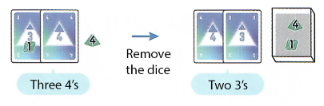

## Overview

A card shedding game where you can use dice to modify cards or play in place of cards. Get rid of all of your cards and dice the fatest to try and score the most points

## Deck makeup

1-10, 4 copies of each card

## Setup 

| Players | Cards |
|---------|-------|
| 2 | 12 |
| 3 | 11 |
| 4 | 10 |
| 5 | 8 |
| 6 | 6 |

- Deal out cards
- Put the box in the middle of the table to serve as dice hell
- Give each player a set of dice. One each d4, d6, d8
- Each player rolls their dice and sets them in front of them
- Lowest total dice is first player

## Card play

On your turn you can play a single card or a set of cards of the same number. Whatever is played are the cards to beat

The next player must play the same number of cards but of a higher value, or any play that is more cards. So three 1's would beat a pair of sixes

The previous cards are discarded, and now there is a new "cards to beat"

## Using dice

Dice can be used in two ways.

- You can modify a card by adding a single die to it. 
    - The die value is added to the card's value and now the card counts as that value. 
    - So I could add a die with a two showing to a played two and it would now be considered a 4
    - You can't add more than 1 die to a card
- You can play a die in place of a card
    - So I could play a single 2 and a die with a value of 2 and that would be considered a pair of 2s
    - You can't add the value of die played this way

## Card play continued

Once a player has finished playing any cards and dice on their turn, any die used that turn are then removed (put them in the central box)

The new value of what to beat is considered to be the number of cards played, but of the lowest value played

If a die is played by itself, it is removed and now there is nothing for the next player to beat. They can play whatever they want

If you are ever left with no dice, but all cards in hand, you immediately regain all of your dice and roll them. They are now available for use again.

## Passing

if you can't play or just don't want to, you can pass. When you pass

- You can gain any dice you want back and reroll them
- You can reroll any of the dice currently in front of you
- You can do both if you want
- You don't have to reroll anything though
- It is a soft pass, so you can get back in at any time
- If there are consecutive passes, the last played cards are cleared and that player can play whatever they want to start a new trick

## End of round

When one player plays all their cards and dice, they are out! Keep playing until 1st through 3rd place are determined

Scoring:

- 1st place rolls all 3 die
- 2nd place rolles 2 smallest die
- 3rd place rolls smallest die

Players gain that main points. Play 3 rounds!

