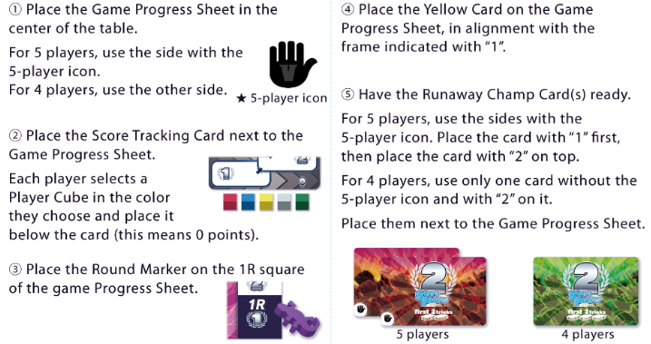
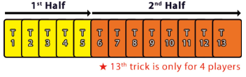
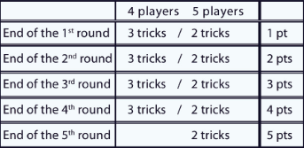

4 or 5 players only

Reptile sports ball where the audience craves cutthroat foul plays! Each round is split into 2 halves. The first half you'll have to be stealthy with your fouls, and in the second half the ref has all but given up and anything goes!

# Overview
- Goal is to win set number of tricks
- Go over and you are eliminated from the round
- Going over or under scores you 0 points

# Deal
- 4 players:
    - Only 1 to 11
    - 13 cards each
    - 1 chameleon
    - 4 rounds, 13 tricks each
    - Goal is exactly 3 tricks
- 5 players:
    - 12 cards each
    - 1 chameleon
    - 5 rounds, 12 tricks each
    - Goal is exaclty 2 tricks

# Gameplay
Each round is split into 2 halves. The first 5 tricks and the rest of the tricks have different winning conditions
- In the first 5 tricks, the 2nd strongest card wins the trick, and the strongest card must sit out the next trick
- From the 6th trick on, the strongest card wins the trick
- Game ends after rounds equal to player count, or when someone scores a total of 6 points

# Trick Play
- Must follow, can lead trump without first breaking
- Can play chameleon card at any time
    - Chameleon cards are played together with another card at the same time.
    - Chameleon card makes whatever card was played with it copy the color of the card played just before it in the trick
    - Chameleon cards can only be used once per round. Once used, return it in front of the player and place it on the black side.
- Highest of lead suit or highest trump is the strongest card.
- In the event of a tie (like if no one follows the lead suit or plays trump, and the same number is played), the earlier card played is considered stronger
- 1st half of the round
    - 2nd strongest card wins the trick, takes the cards and puts them in a pile face down in front of them.
    - Strongest card played gets the yellow card and puts it in front of them
    - That player then discards a card from their hand face down on to the game progress sheet.
    - That player then sits out for the next trick.
    - Put your hand of cards down w/ the yellow card on top of it to make sure you remember to not play next round
- 2nd half of the round
    - Yellow cards are no longer rewarded
    - Strongest card wins the trick

- The player that gets the yellow card in the 5th trick will still sit out the 6th trick, no yellow cards will be awarded anymore.
- Whoever wins the trick starts the next trick.
- Whenever a player goes over the target number of tricks, they are eliminated from the round and will not play in anymore tricks. Their cards are placed in front of them face down.
- If a player is elimnated, then the player to their left leads the next trick. If this happens in the first half of the round, players with a yellow card are skipped over

# Runaway Champ Card
The first player to get the target number of tricks gets the runaway champ card for possible bonus points.
- In a 4 player game only the card with the 2 is awarded
- In a 5 player game the first player to hit the target is awarded the 2 point card, with the 2nd player hitting the target being awarded the 1 point card.

# Scoring
Round ends whenever all the tricks have been played. Players who hit the target number exactly will be awarded points based on the round number. Bonus points from the runaway champ card are only earned if the player is not eliminated

# End of the round
If neither game end condition were met, prepare a new round.
- Redeal cards
- Place yellow card on 1 space of progress sheet
- Eliminated players are back in
- Person who was awarded the 2 point runaway champ card starts the new round (regardless of elimination status)

# End of the game
The game ends if either condidtion are met:
- A player has reached 10 or more poitns
- A number of rounds equal to player count have been played

