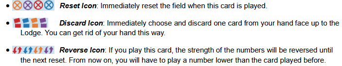

## Summary

We're teams of mountain climbers racing to get to the top of the mountain every season. Object of the game is to get rid of cards from your hand. Over the course of the game, we will be adding new cards to our pools of available cards to use

The game takes place over 5 season. In each season your score VP by emptying your hand first or secod.

## Deck Makeup

1-7 in 4 different colors to start

46 reincforcement cards with different values and effects

## Setup

1. Arrange the 5 Silver Season Cards from left to right as "1st Season" to "5th Season" on the table.
2. Place the "Standard" Gold Season Card slightly overlapping the "1st Season" Silver Season Card.Place the "Climax" Gold Season Card slightly overlapping the "5th Season" Silver Season Card.
3. Shuffle the remaining 6 Gold Season Cards face down and place 3 of them face down on the "2nd Season," "3rd Season," and "4th Season" Silver Season Cards. Return the remaining 3 Gold Season Cards to the box.
4. Each player receives 1 Lodge Card and places it in front of them with the summary side up.
5. Shuffle the Initial Cards face down and deal 7 to each player. In a 3-player game, return any remaining Initial Cards to the box.
6. Shuffle the Reinforcement Cards face down and deal 2 to each player. Place the remaining Reinforcement Cards face down within reach of all players as a draw pile.
7. The player who has climbed most recently receives the Start Card.

## Gameplay

Each players set of play cards is called a team. Teams generally remain with the player throughout the game and are not redistribuited.

There are initial cards (1-7 in 4 suits) and reinforcement cards which have a variety of effects. Each team begins the game consisting of 7 initial cards and 2 reinforcement cards.

Each season consists of the following phases:

- Rule reveal
- Hand Selection
- Main
- End

### Rule reveal phase

The special rules for the season are revealed using the gold season cards. Some gold season cards require actions at this phase.

The rules for the 1st and 5th season are visible at the start, and are the same every game

### Hand selection phase

Each player selects the cards they will use for the current season from their team. The number of cards to select varies by season and is indicated on the Silver Season Card. Place the unused cards face down under your Lodge Card in the Lodge space.

### Main phase

At thge start of each season's main phase, the player with the start card must play it. The start card is the weakest card with no number. The player with this card must play it at the start of the main phase as a single. The next player can play any number but cannot play a set or run.

Other players take turns clockwise either playing or passing

- Playing: Play cards from your hand following these rules
    - Played cards must be of the same type as the previous play
    - Played cards must be of the same quantity as the previous play
    - Played cards must have a higher number than the previously played cards
    - If you already have cards played in front of you, just play the new ones on top of them

- Card play types:
    - Single
    - Set
    - Run (have to be same color, minimum of 2 cards)

- Passing
    - If you can't or don't want to play, you can instead pass
    - PLace your lodge card with the pass side up in front of you. If you have played cards in front of you already, put the lodge card on top of them. 
    - A player who has passed skips their turn until the field is reset

- Resetting
    - When all but one player has passed, the field is reset.
    - Each player moves all their played cards to their lodge space, placing them on top of other cards in the lodge. Keep these cards face up to distinguish them from cards that haven't been played. The lodge card then goes on top of these cards with the summary side up.
    - The player who did not pass leads with whatever they want

- End of main phase
    - The first player to get rid of their hand becomes 1st place for the season. The last cards played by this player remain on the field until the field is reset. Skip that player's turn and continue play. If no one can beat the final card played by the player that runs out of cards, the field is reset and the next player in turn order leads out.
    - When a second player runs out of cards the main phase ends immediately

### End phase

After the season ends each player receives their season rewards

- 1st place player
    - Receives the gold season card for that season and gains the VP indicated on it
    - Receives the start card and places it in front of them
    - Draws 1 reinforcement card from the draw pile and adds it to their team
- 2nd place player
    - Receives the silver season card for that eason and gains the VP indicated on it
    - Draws 2 reinforcement cards from the draw pile and add them to their team
- All other players
    - Draw 3 reinforcement cards from the draw pile and add them to their team

Any reinforcement cards drawn are added to the pool of cards that a player can sleect from in the hand selection phase at the beginning of a season.

## End of the game

After five seasons the player with the highest total VP from the season cards win. In the case of a tie, the player with the most cards in their team wins.

## Reinforcement card details

### Higher cards

- There are 8-11 in each of the 4 starting suits. These cards also have powers

- Special icon usage is mandatory
- If multiple cards with icons are played, only one is resolved. Either the icon on the highest card in a run, or the icon of a single card in a set

### Wild color

There are cards with all 4 colors on them in 0-7. They can be played as any color and played as a single or in a set or run

### Colorless cards

12, 13, and 14 with no color. They cannotr be played in a run.

### Other icons

## Season cards

- Standard (5VP)
    - No special rules
- Reverse (6VP)
    - The turn order will be counterclockwise instead of normal
- No Set (7VP)
    - Sets cannot be played this season. Cards with the 'set of two' icon can be played as singles
- Transfer (7VP)
    - Before the hand selection pahse, each player simultaneously selects a card from their team and passes it to the player on their left
    - Cards received can be used this season
    - Cards that exchange hands will remain there for the rest of the game
- Up to 2 cards (8VP)
    - The number of cards that can be played is limited to 2. Sets or runs of more than 2 cards cannot be played. 
    - Cards with the mountain symbol can't get around this rule
    - Cards with the 'set of two icon' can be used to get around this rule. Since you can play up to 2 cards, if you play two and one of them has the 'set of two' symbol, it will count as a set of 3
- Accident (8VP)
    - Before the hand selection phase, each player shuffles their cards and places them face down. Then each player draws one card randomly from the shuffled deck. 
    - The drawn card is placed in the lodge
    - The card will not be available to use for this season
- Revolution (9VP)
    - The strength of cards is reversed. The smaller the card, the stronger
    - The effect of the reverse icon is also reversed
- Climax (10VP)
    - You can add as many cards as you want to your hand after the initial 12.
    - In this season the winner will get 10VP + VP equal to the number of cards they added to their hand
    - Players must announce the number of cards added before starting the main phase

