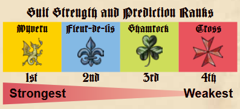

# Overview
We're participating in a grand jousting tournament, or a Tornei if you will. This is a must follow game where we'll be predicting what place our cards will come in every trick

### Player count
Game plays with a dummy player at 3, so play it at 4

### Deck makeup
1-14 in each suit

# Setup
- Give each player a player board
- Deal 14 cards to each player

# Gameplay
Tricks are divided into the prediciton phase and the play phase.
- Every player will end up playing 2 cards into the trick. One that we will compare ranks of, and one that will be what place you think you will come in
- The object of the game is to say "when the joust cards are ranked by strength, what place will my card be in?"

### Card Strength
When we determine card strength, there are 2 factors.
- First, cards are orded by suit, strongest to weakest

- Your player boards have a reminder of suit strength on them
- Then, cards with the same suit are ranked by their numbers from highest to lowest

### Prediction phase
- Player to the left of the dealer is the lead player and begins the game
- Lead player plays a card face up as their joust card
- Lead player plays a card face down as their prediciton card
- Players then go around in turn order and play a card face down as their prediction card
    - Keep in mind, when you play a card face up later this turn, the game is must follow
- At this point, only the lead player has played 2 cards, the other players have only played their prediciton card face down
- Your prediciton card's number does not matter. The suit of the card is your prediction.
    - So a face down yellow card is saying you're betting that you'll come in first
    - A face down green card is betting that you'll come in third
- Once all players have played a prediction card, the trick moves to the play phase

# Play phase
- Starting with the player to the left of the lead player and continuing clockwise, each player plays a face up card as their joust card
- Must follow lead suit if able
- Rank the four played cards by strength
- Each player then reveals their prediction card and checks to see if they were correct
- Players then place their prediction card face-up on their player board:
    - If the prediction was correct, the card goes above the board
    - If the prediction was incorrect, the card goes below the board
    - Cards are placed face up so that the numbers are visible
- Then the player that played the strongest card collects all of the joust cards that were played and places them faced down to the side of their playerboard, keeping tricks separate
- The player that played the strongest card leads the next trick with another prediction phase

# Scoring
When players hands are emptied, calculate score according to correct predictions and tricks won.
- For each correct prediction (cards on top of player board):
    - Yellow: 2 points each
    - Blue: 3 points each
    - Green: 3 points each
    - Red: 2 points each
- Each trick won is worth 1 point
- If the player took 0 tricks it is worth 3 points
- The player to the left of the previous dealer is the new dealer

# End of game
- Play 4 rounds (everyone is dealer once)
- Most points wins

