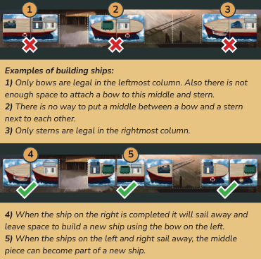

In 1870 people figured out sail boats suck ass, and the steam engine is the new hotness. We're going to be building new ships and expirimenting design competing for the blue riband, which is awarded to the fastest shit to cross the Atlantic.

# Gameplay
We take turns clockwise to take actions with the goal of contructing ships. Ships are built on your playerboard, and when completed, will go on a shakedown cruise on the canal where they will have to meet certain requirements. If you don't meet those requirements your ship will fall apart (that's bad). Points can be scored during the game during these cruises, where you get more points the more stuff is on your ship. Government contracts will provide points at the end of the game. 

A turn will have you choose an available action from the action track. On your next turn you will move that tile ahead of all the others, and then take another action. As people are taking turns, the cube on the turn tracker will advance around it. When it reaches the last position and drops in the hole, the turn is completed, then a cube is removed from the queue above the action track. The game end is triggered when we go to remove a cube from the queue and cannot. The game will also end if we run out of ship tiles

As cubes are removed from the track, you will have to discard some of your held end game objectives

# Turn Structure
A turn has 5 steps:
1. Advance previous turn's tile (skipped during first turn)
    - Your tile is moved to the rightmost action space, pushing the others back and moving the wheel forward. If your tile is the rightmost already, you still move the wheel
2. Choose a new action, placing your cube on it
    - Action tiles can only hold 1 player cube
    - You can't choose the action you just moved to the front
    - You must be able to perform the chosen action
3. Income
    - When a cube is placed, that player receives 1 income for each cube ahead of them on the track
4. Performing your chosen action
    - You can also pay 6 money at any time on your turn to take a bonus action.
    - The bonus action can be any other action, including the one you moved to the front in step 1 of your turn, or even one with another cube on it.
    - You do not use a cube to mark a bonus action.
    - A bonus action can be performed before or after your main turn action.
    - You have to pay for your bonus action when you take it. You could use money gained from your main action to pay for it, but not money gained from the bonus action to pay for itself
5. Your ships completed this turn go on a shakedown cruise
    - A ship is complete when it has a bow on the left, at least 1 middle part, and a stern on the right, with no empty spaces. Ships completed after step 4 of your turn must leave your shipyard to be tested in the canal system. 

# Actions
1. Build Ships 

- You can buy 1, 2, or 3 ship parts in any combination from the board
- For each tile bought, pay the indicated cost of 0-2 coins each
- A coompleted ship must have a bow, a number of middle pieces, and a stern, with no empty spaces.
- A ship can be at most 7 pieces in total
### Placement rules
- Ships tiles are placed in the empty dotted spaces at the bottom of your ship board
- Once placed, they cannot be moved or re-arranged
- You can't fill up all your spaces unless the result is at least one completed ship
- You can't place a tile that would be impossible to become part of a completed ship. However, it is legal to add on to ships that need another shipt to leave before they can be completed

- After placing all tiles, slide tiles on the board downward so the only empty tiles are at the tops of the columns. Then refill from the tiles with No 1 on their backs.

2. Rent a Canal

- Canals are used by your ship to earn points during the shakedown cruise
- Buy one of the available canal tiles from the main board, paying the cost.
- Tiles then slide over and a new one is refilled
- Place canal tiles in front of you. New tiles are placed adjacent to extend your canal system, and sides have to match
- You place your ship token when you begin a shakedown cruise, and can enter the canal from any point
- You can't re-arrange canal tiles or move or reorient your ship once placed
- You will want to match up canals with ships that you are building

3. Purchase Commodities

- Buy one of the available commoity tiles, paying the inicate cost
- Slide down tiles, then refil
- Used to trade a the commodity exchange for money, equipemnt, or crew in a separate action

The symbols of the next actions coorespond to the part of the main board wheel where they take place

4. Manufacture Equipment

- move the cube on the equipment wheel one space forward, this indicates which is free
- if you want a different piece of equipment, move the marker around the ring, paying 1 money for each move
- equipment is stored next to your player board and attached to completed ships as they leave for their shakedown cruise
- equipment will be attached to ships for the rest of the game
- equipment needs mounting points

5. Recruit Crew

- bought from wheel in the same way as equipment
- every ship needs a captain to score points
- every crew member besdies the captain needs a cabin, and most will score you points
- additional captains become offices and need cabins as well

6. Hire Employee

- Outside wheel works the same as previous actions, with there being 3 differnt choices at each stop
- Some employee tiles show an extra cost
- You cannot take an employee that is the exact same as you already have (you could have 2 of the same role, but only if they do different things)
- Employees are kept next to your board and will work for you and provide benefits until the end of the game
    - Traders (red) give you higher prices for selling goods. You can't hire the level 2 version unless you have the level 1. Effects are cumulative
    - Builders (blue) allow you to add extra crew or equipment to your ship without neededing moutning points or cabins
    - Enginers (grey) allow you to take the depicted equipment in addition to your normal selection when taking that action
    - Recruiter (green) Same thing as above, but with crew
    - Yellow tiles let you move the cube up to an additional amount for free
    - Blue tiles with the speed icon give you extra speed

7. Exchange Commodities

- You can only take this action if you already have a commodity tile
- Ring selection works differnt for this action. You still start by moving the cube forward one space, but cannot pay for extra
- This will determine the commodity prices.
- Choose which commodity tile of your you are exchanging. For each commodity on the tile, you can decide to sell it for the indicated value, or trade it for one of the items depicted in the tables on the corners of the game board
- You cannot chose to exchange 2 commodities for the same equipment or crew
    - if you had 2 coal, you couldn't buy 2 smokestacks with them, but you could get 1 stoker and 1 smokestack

8. Receive Subsidy (only in 4 player game)

- Get 2 money from the bank

# Shakedown Cruise
Completing a ship during your turn means it will have to be sent on a shakedown cruise at the end of your turn. Multiple ships completed mean multiple cruises, you decide the order in which they happen.
- Ship must be one bow, one stern, at least one middle piece, no empty spaces
- Equipment and crew are not added to your ship until it is complete. These will stay with the ship they're placed on and not be used on a differnt ship later
- You can only use equipment and crew in your player area, and this is a free action
- Every ship must have a captain, and he does not need a cabin. Additional captains would need cabins, and each other crew member needs a cabin
    - stokers have a specific cabin, all other crew have generic cabins
- Equipment needs a mounting point of a matching color
    - sails and smokestacks share the same type of mounting point
- Each moutning point can only have 1 equipment
- Each cabin can only have 1 crew member
- You are not forced to use all of your equipment and crew that you could, you can always choose to not place them
!!! note
    All of the following info regarding speed and points is shown on the chard on the action board

- Speed
    - A ship with at least 1 stoker + 1 smokestack has a base speed of 4. Additional sails, stokers, and smokestacks give +1
    - A ship with no smokestack + stoker combo has a base speed of one. Every sail and stoker is +1, every pair of smokestacks is +1
- Requirements to score
    - Ship must have a captain
    - Your canal system must be long enough for your ship to move forward at full speed
    - A ship not meeting these requirements is removed from the game and will not count for final scoring (so don't put anything on it)
- Scoring
    - Each crew member besides stokers is 1 points
    - Each crane and cannon is 2 poitns
    - 1 point per speed
    - Shakedown results:

- As the ship moves through your canal, each space it moves across can award different points
- A ship must move a number of spaces equal to its speed.
- Blue ribbon spaces give you points for how many speed you have used when you land on it. So if you land on it with your 4th movement, you get 4 points
    - If you hit multiple blue ribbon spaces, only the last one counts
- When moving your ship token, you can go down different paths, but never move backwards
- When your movement ends, your ship token stays there, and your next shakedown cruise will begin from that point
- When your ship enters a new canal tile, remove the old one from your system and place it facedown in a stack next to you 
    - Some end game scoring may care about this

After scoring your ship, move it to the empty space at the top of your shipyard with all equipment and crew on it. End game scoring may care about features.

# End of the Game
Each time the turn marker completes a rotation, a cube is removed from the queue. When we go to remove a cube and can't, end game is triggered. We finish out the round. The game can also end if the last bow stern or middle ship tile is taken from the stack and put into the game. Game ends immediately in that case. 

## Final Action
After that, we each get one final action, ignoring cube placement, and regardless of your previous action. It is possible for multiple players to all take the same final ation. If your final action completes a ship, take it on a shakedown cruise like normal.

## Final Ship Build
After each player has had their final action, everyone gets the chance to build a ship. If you have a ship that only requires 1 tile to be completed, you may buy it from the market in the usual way. If a ship is completed this way, take it on a shakedown cruise like noromal

# Final Scoring
- Reveal government contracts and score them
- Score any points from red trader workers
