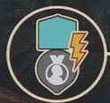

```
We are members of a psychological society started by Sigmund Freud devoted to psychoanalysis (or study of the unconscious mind). 

As members of this society, we aim to come up with new therapeutic techniques, grow our clientele, and become Freud’s most distinguished contemporary. To do this we will discuss ideas with peers, compile notes, and publish theory. To do all this we’ll also need a lot of coffee
```

The game is played over a number of rounds until Freud's reputation marker moves onto the end of the reputation track, triggering the end of the game. On your turn, you will choose one of 3 options:
- State Ideas
- Recall Ideas
- Treat Clients

# General Concepts
**INSIGHT**
Each player has a large wheel to track their insight. The wheel has different wedges for the differet insight qualities, as well as different rings for the insight levels.

There is a center reserve, where generated insight is pulled from. While in the reserve, insight has no quality or level. You will start the game with only white insight, but can add ones of your player color throught the game.

To generate insight (gesture to symbol), move from your reserve to the cooresponding area. If none in reserve, you can pull any insight of board to use to generate the new one instead.

Effects that look like arrows will let you move insight, or change levels. When increasing level, you can't go from 0 to 1. When decreasing level, you can go from 1 to 0.

To pay insight, move it from the idicated area to your reserve. You can always use a higher level insight of the same quality to pay for a cost. So you could pay a minor insight by using a median insight of the same color.

There are generic colorless insight shapes that refer to any insight of the depicted level. There is a spot on your playerboard where you can trade a minor, median, and major insight for a heart shaped box.

**REPUTATION**
On the city board is a reputation track that does two different things. Any time a player one goes up, so does Freud’s. Him reaching the pocketwatch triggers the end of the game. Finish out round + one more. Gaining reputation advances the clock of the game, no matter who does it.

When you gen a reputation (looks like a medal), first move Freud’s marker and then yours. If any marker crosses a line with the little face on the track, this make’s Freud’s meeple move locations, and this can happen multiple times in a turn.



*This icon triggers the reputation track. When this happens you score points/coffee show at the zone above the track in the section where your marker is.Then look at the zone below the track. You can perform any one action from Freud’s section or lower.*


# Heading
- Bullet point
- Bullet point
- Bullet point

## Smaller Heading
1. numbered list iten
2. numbered list item
3. numbered list item

### Smallest Heading